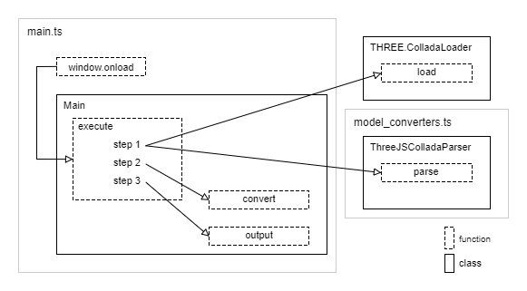
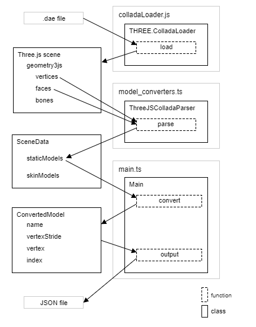

# モデルデータの作成 - Basic model data converting

## 概要

基本的なモデルデータのコンバート処理のサンプルプログラムです。

Collada形式(.dae)のファイルからモデル情報を抽出し、json形式(.json)で出力します。.daeファイルのパースにはThree.jsのColladaLoaderを利用します。

実行すると画面開始時にコンバートが実行されます。再度コンバートを実行したい場合、デベロッパーツール上でF5を押してください。

ソースコード

- [サンプルプログラム（main.ts）](./main.ts)  
- [パース処理（model_converters.ts）](../tips_core/model_converters.ts)  

デモの実行

- [Live Demo](https://warotarock.github.io/ptw_tips/tips/basic_model_converting/)  
<br />
<br />

### キーワード

意味の分かりにくい単語がありますので、以下にキーワードをまとめました。

|単語|説明|
|:-----------------|:-------------------------|
|スタティックメッシュ|変形しないモデルのための形状データ。一般的な単語としては形状データの内容は問われませんが、本サンプルでは頂点座標、頂点法線、テクスチャ座標だけを持つ形状データを指してこの単語を使用しています。|
|スタティックメッシュモデル<br />スタティックモデル|スタティックメッシュを使用したモデル。|

<br />
<br />

## コンバート処理

### 目的のモデル

目的のモデル、つまりコンバート処理の結果として得られるモデルは、スタティックメッシュモデルとします。これは頂点バッファとインデックスバッファによる単純な描画のためのモデルです。すべてのポリゴンが三角形であり、頂点は座標、法線、テクスチャ座標を持ちます。

なお、テクスチャをはじめとするマテリアルに関する情報はプログラム側で指定することとし、モデルデータには含めません。


### 入力ファイル

サンプルプログラムではCollada形式(.dae)のファイルからモデル情報を抽出し、json形式(.json)で出力します。daeファイルのパースにはThree.jsのColladaLoaderを利用します。

また、メッシュに関する追加の情報を取得するために、.blendファイルも参照します。これはテクスチャとＵＶマップを対応付ける情報が部分的にしか.daeファイルに無いためです。


### 入力ファイルの準備

.daeファイルはBlenderから標準のエクスポータでエクスポートしたものです。サンプルの.blendファイル中にエクスポートを実行するスクリプトを用意しましたので、Blenderのテキストエディタでスクリプトを実行すればエクスポートを実行できます。

```
import bpy

basePath = bpy.path.abspath('//')
fileName = 'sample_basic_model.dae'

bpy.ops.wm.collada_export(
    filepath = basePath + '/' + fileName
    
    , apply_modifiers = True
    , export_mesh_type_selection = 'render'
    , selected = False


    , active_uv_only = False
    , include_uv_textures = True
    , include_material_textures = True
    , use_texture_copies = True

    , deform_bones_only = False
    , open_sim = False
	
    , triangulate = True
    , use_object_instantiation = True
    , export_transformation_type_selection = 'matrix'
    , sort_by_name = True
    )
```

またメニューからもFile->Export->Colladaと選択してエクスポートを実行できます。エクスポートの設定は以下の通りです。

```
Export Data Options
    Apply Modifiers: View
      (Export mesh type selection): Render
    Selection Only: false

Texture Options
    Only Selected UV Map: false
    Include UV Textures: true
    Incluede Material Textures: true
    Copy: true

Armature Options
    Deform Bone Only: false
    Export to SL/OpenSim: false

Collada Options
    Triangulate: true
    Use Object Instances: true
      (Transformation): Matrix
    Sort by Object name: true
```


### 入力データ

daeファイル内のモデル情報はBlenderのMeshを元にしてdaeファイルの構造に変換され出力されています。さらに、Three.jsのColladaLoaderはファイルを解析し、Three.jsのジオメトリの形式に変換します。このオブジェクトがコンバート処理のの実質的な入力データとなります。

以下にColladaLoaderの返すオブジェクトのおおまかな構造を示します。ここで\{ \}はオブジェクト、[]は配列を表しています。

```
(ColladaLoaderの返すオブジェクト)
  dae
    geometries{}
      mesh{}
        geometry3js{}
          vertices[]      頂点の座標
          faces[]         面の頂点インデクス
          faceVertexUvs[] 面の頂点UV
```


### 出力するモデルデータ

出力するモデルの頂点データのフォーマットは次の通りです。。テクスチャ座標もＵＶマップをもとに出力します。複数のＵＶマップが存在する場合は複数のテクスチャ座標が出力されます。テクスチャ座標の順番はBlenderのマテリアルに設定されているテクスチャの順番になります。

|  |内容              |型     |個数|
|:-|:-----------------|:------|:---|
|1|頂点位置 x, y, z   |float  |3   |
|2|頂点法線 x, y, z   |float  |3   |
|3|テクスチャ座標 u, v|float  |2 * UVマップの数|


### 出力ファイル

出力するJSONファイルの構造を以下に示します。

```
{
  "models": {
    "モデル名": {
      "vertexStride": １頂点のサイズ(float型の個数),
      "vertex": [頂点データ(インターリーブ配列)],
      "index": [面の頂点インデクス]
    }
  }
}
```
<br />
<br />


## サンプルプログラム

### プログラム構成



上の図はクラスと関数の呼び出し関係を表しています。コンバート処理はMainクラスのexecute関数で行われます。この関数は画面のロード時に実行されます。

コンバート処理では、まずThree.jsのColladaLoaderのload関数でファイルを読み込み、その後コンバート処理の各ステップを実行します。


### コンバート処理の３段階

1. ファイルのパース  
ColladaLoaderで読み込んだdaeファイルから、さらに用途や出力形式に依存しない構造で抽出する。

2. 必要データの抽出と再構成  
上の結果から必要なデータのみを出力処理に適した構造で再構成する。

3. 出力 
JSONファイルへの出力を行う。

コンバート処理は上記の３段階に分けて実装しています。段階に分けることにより、各段階ごとのコードの保守性と再利用性を高めることが期待できます。また、複雑になりがちなコンバート処理を整理しながら実装しやすくなると筆者は考えています。

### コンバート処理の流れ



上の図はデータとそれを処理する関数の関係を表しています。左側はデータのクラスやファイル、右側は処理を行うクラスと関数です。

これら全ての処理はMainクラスのexecute関数で行われます。それぞれの関数で行う処理の詳細については、ソースコードを参照してください。


## クラスの解説

### THREE.ColladaLoader (Three.js)

[Three.js](https://github.com/mrdoob/three.js)のColladaLoaderです。Three.jsのリポジトリの[Loaders](https://github.com/mrdoob/three.js/blob/dev/examples/js/loaders/)から入手できます。


### ThreeJSColladaParser (model_converters.ts)

Three.jsのColladaLoaderで読み込んだデータから用途や出力形式に依存しない構造でデータを抽出するクラスです。parse関数を実行するとスタティックメッシュモデルとスキンメッシュモデルを全て抽出し、ScenDataとして返します。

※スキンメッシュについては[スキンモデルデータの作成](../skinning_model_converting/)で解説します。

なお、このクラスでは抽出のみを行い、コンバートにあたる処理は行いません。


### SceneData (model_converters.ts)

ThreeJSColladaParser.parse関数が返すオブジェクトのクラスです。このクラスには入力ファイルから抽出できる全てのデータが含まれます。

このクラスは用途や出力形式に依存せず、プログラムから操作しやすい構造にしています。その反面、ファイルへの保存やWebGLの描画処理といった目的に最適化された構造ではありません。そのための最適化はMain.convert関数で行います。


### ConvertedModel (main.ts)

Main.convert関数が返すオブジェクトのクラスです。このクラスにはサンプルプログラムでモデルを描画するための最低限のデータのみが含まれています。

このクラスのオブジェクトをJSON.stringify関数を使ってテキスト化すれば、簡単にファイルに保存できます。また、モデルを描画するプログラムではJSON.parse関数でパースを行えば、すぐに頂点バッファやインデクスバッファのデータとして利用できます。

なお、サンプルプログラムでは出力結果をテキストエディタ等で見やすいようにある程度整形してテキスト化していますが、そのままJSON.stringify関数でテキスト化しても問題ありません。


## 使用外部ライブラリ

- THREE.js, colladaLoader.js
  

## 関連情報

- [Blendファイルからのデータ抽出](../blend_file_reader_sample/)