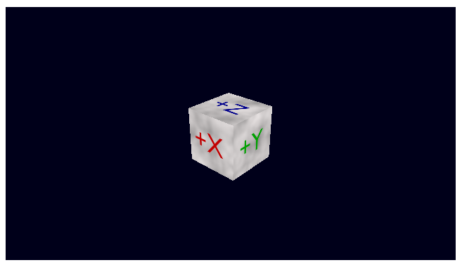

# モデルの描画 - Basic model drawing

## 概要

※作成途中です

基本的なモデルのロードと描画処理です。ほとんどの内容は[TypeScriptによる基本的なWebGLプログラミング](./basic_webgl_ts/)と同じですが、以下の変更があります。

- [モデルデータの作成](./basic_model_converting/)で作成したモデルデータをファイルからロードして使用
- 共通のサンプルプログラム用シェーダクラスを使用

ソースコード

- [サンプルプログラム（main.ts）](./main.ts)  
- [共通シェーダクラス（shaders.ts）](../tips_core/shaders.ts)  

デモの実行

- [Live Demo](https://warotarock.github.io/ptw_tips/tips/basic_model_drawing/)  

## 関連情報

- [TypeScriptによる基本的なWebGLプログラミング](./basic_webgl_ts/)
- [モデルデータの作成](./basic_model_converting/)
