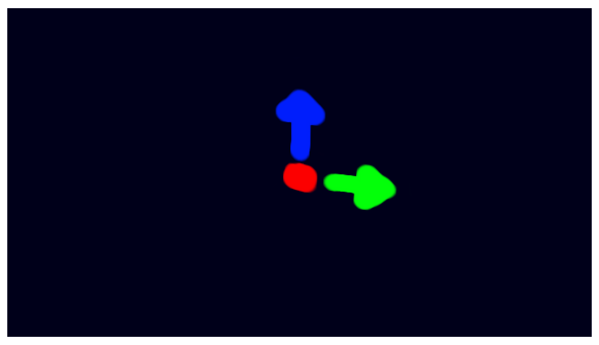

# TypeScriptによる基本的なWebGLプログラミング - Basic TypeScript-WebGL programming

## 概要
TypeScriptによる基本的なWebGL(1.0系)プログラム実装のサンプルです。 

ソースコード

- [サンプルプログラム（main.ts）](./main.ts)  
- [レンダラ（render3d.ts）](../tips_core/render3d.ts) 

ライブデモ

- [Live Demo](https://warotarock.github.io/ptw_tips/basic_webgl_ts/)

## TypeScriptによるWebGLプログラミング
PTW TipsではTypeScryptでプログラムを記述します。TypeScryptを使用すると、静的型チェックやオブジェクト指向プログラミングといった便利な機能が利用可能です。

## サンプルプログラム

### モデルクラス(RenderModel)
主な目的

- ３Ｄモデルのバッファオブジェクトを保持する
- 描画時に必要なその他の情報を保持する

#### ３Ｄモデルのバッファオブジェクトを保持する
RenderModelクラスの主な目的は３Ｄモデルの頂点とインデックスのバッファオブジェクトを保持することです。これにより、３Ｄモデルを利用する側でそれぞれのバッファへの参照を一つずつ持たずにすみます。

またバッファを解放しても３Ｄモデルへの参照を保持することができ、再度バッファを作成しても参照を更新する必要がなくなります。このことは、ある程度以上の規模のゲームなど、リソースの確保と解放を繰り返し行う場合に特に意味があります。

#### 描画時に必要なその他の情報を保持する
RenderModelクラスは描画の際に必要となる、バッファに関連する情報も保持します。たとえば、頂点データの全体の要素数や１要素のサイズなどです。またバッファにセットした元データについても、後に利用する必要がなければ無くてもよいのですが、利用する場合もあるため保持するようにしてあります。

#### （余談）頂点バッファのインターリーブ配列
なお、WebGLを学習するためのサンプルプログラムの多くでは頂点座標、法線、ＵＶといった頂点情報に別々のバッファを作成する方法を取っています。それには種々の理由があると思われますが、このサンプルでは全ての頂点情報を一つのインターリーブ配列にまとめ、一つのバッファを作成します。その理由は、パフォーマンス面の理由もありますが、描画の際に必要な情報は３Ｄモデルの内容ではなくシェーダの内容によって確定されることが多い（と筆者は感じている）からです。そのためRenderModelクラスはできるだけシンプルな形にしておき、シェーダに重要な実装を集中させる方針をとっています。

#### （余談）RenderModelへの機能追加時の注意点
将来的にRenderModelに機能を追加するとき、RenderModelには描画に直結する情報だけを持たせるようにしたほうが良いと筆者は考えます。たとえば３Ｄモデルのファイル名などの情報はこのクラスに持たせるべきではありません。ファイル名は描画に直接関係がない情報だからです。そういった情報はRenderModelを内包する、例えば "ModelResource" のような名称のクラスに持たせるべきでしょう。

### イメージクラス(RenderImage)

主な目的

- テクスチャオブジェクトを保持する

RenderModelクラスの目的はWebGLのテクスチャオブジェクトを保持することです。対象がテクスチャであること以外、基本的な考え方はRenderModelと同じです。

### シェーダクラス(RenderShader)

主な目的

- WebGLProgramなどシェーダに関するオブジェクトを保持する
- WebGLを操作する関数を提供する
- 疑似差分プログラミングを可能にする

RenderModelクラスの主な目的は三つあります。一つめはシェーダなどのWebGLオブジェクトを保持すること。二つめはシェーダに依存するパラメータをWebGLコンテキストに設定する関数を提供すること。三つめはTypeScriptのオブジェクト指向の機能を使ってシェーダプログラムの疑似的な差分プログラミングを可能にすることです。

#### シェーダの疑似的差分プログラミングについて
シェーダの実装方針について、下記のサンプルをもとに説明します。
GLSL ES 1.0には差分プログラミングの機能はありませんので、疑似的な方法ということになります。

TypeScript

    class BasicShader extends RenderShader {

        aPosition = -1;
        aTexCoord = -1;

        uTexture0: WebGLUniformLocation = null;

        initializeVertexSourceCode() {

            this.vertexShaderSourceCode = ''
                + this.floatPrecisionDefinitionCode

                + 'attribute vec3 aPosition;'
                + 'attribute vec2 aTexCoord;'

                + 'uniform mat4 uPMatrix;'
                + 'uniform mat4 uMVMatrix;'

                + 'varying vec2 vTexCoord;'

                + 'void main(void) {'
                + '	   gl_Position = uPMatrix * uMVMatrix * vec4(aPosition, 1.0);'
                + '    vTexCoord = aTexCoord;'
                + '}';
        }

        initializeFragmentSourceCode() {

            this.fragmentShaderSourceCode = ''
                + this.floatPrecisionDefinitionCode

                + 'varying vec2 vTexCoord;'

                + 'uniform sampler2D uTexture0;'

                + 'void main(void) {'
                + '    gl_FragColor = texture2D(uTexture0, vTexCoord);'
                + '}';
        }

        initializeAttributes(gl: WebGLRenderingContext) {

            this.initializeAttributes_RenderShader(gl);
            this.initializeAttributes_BasicShader(gl);
        }

        initializeAttributes_BasicShader(gl: WebGLRenderingContext) {

            this.aPosition = this.getAttribLocation('aPosition', gl);
            this.aTexCoord = this.getAttribLocation('aTexCoord', gl);

            this.uTexture0 = this.getUniformLocation('uTexture0', gl);
        }

        setBuffers(model: RenderModel, images: List<RenderImage>, gl: WebGLRenderingContext) {

            gl.bindBuffer(gl.ARRAY_BUFFER, model.vertexBuffer);

            this.enableVertexAttributes(gl);
            this.resetVertexAttribPointerOffset();

            this.vertexAttribPointer(this.aPosition, 3, gl.FLOAT, model.vertexDataStride, gl);
            this.vertexAttribPointer(this.aTexCoord, 2, gl.FLOAT, model.vertexDataStride, gl);

            gl.bindBuffer(gl.ELEMENT_ARRAY_BUFFER, model.indexBuffer);

            gl.activeTexture(gl.TEXTURE0);
            gl.bindTexture(gl.TEXTURE_2D, images[0].texture);
            gl.uniform1i(this.uTexture0, 0);
        }
    }

BasicShaderクラスはRenderShaderクラスを継承しています。しかし、RenderShaderにはいくつかの補助的な機能しか含まれていません。シェーダ個性が決まるような中核となる部分は、継承先のクラスで関数をオーバーライドして実装します。

BasicShaderクラスではinitializeVertexSourceCode関数とinitializeFragmentSourceCode関数をオーバーライドし、それぞれ頂点シェーダとフラグメントシェーダのソースコードの文字列を初期化しています。シェーダのソースコードが関数内に組み込まれているのは、WebGLのサンプルプログラムとしては珍しいかもしれません。しかし関数になっていることで、クラスの機能を使って、変更したい部分だけを記述して新たなシェーダクラスを作ることができます。  
例えば上記のサンプルでもソースコードに変数を使用しています。

        initializeVertexSourceCode() {

            this.vertexShaderSourceCode = ''
                + this.floatPrecisionDefinitionCode // 変数を使用している

                + 'attribute vec3 aPosition;'
                ...

また、シェーダクラスではinitializeAttributes関数内でattribute変数やuniform変数の取得を行っています。こちらもシェーダのソースコードと同様に、クラスの作り方しだいで差分だけを記述することができます。例えば、継承元クラスの関数と新しく作成した関数をそれぞれ呼び出すことで実現できます。

        initializeAttributes(gl: WebGLRenderingContext) {

            this.initializeAttributes_RenderShader(gl); //継承元クラスの関数
            this.initializeAttributes_BasicShader(gl); //このクラスの関数
        }

#### attribute変数の扱いについて

attribute変数は、変数ごとにenableVertexAttribArray関数を使ってＧＰＵのレジスタを有効化する必要があります。また、必要がなくなればdisableVertexAttribArray関数を使って無効化する必要があります。この処理はRenderShaderクラスの基本機能として用意しています。  

#### 接頭辞について

筆者は以下のルールで接頭辞（prefix）を付けた変数名を使用しています。

- uniform変数は u から始める
- attribute変数は a から始める
- varying変数は v から始める
- JavaScript側も同じ変数名にする

接頭辞を付ける理由は、たとえばＵＶ座標のように、attribute変数をそのままvarying変数に渡すだけで済む場合があるためです。例えばaTexCoordとvTexCoordは本来同じものを意味するものですが、GLSLの仕様上、違う名前でそれぞれ用意する必要があります。さらに、TypeScript(JavaScript)側でも変数を持つ必要がありますので、筆者はこれらは同じものであることが分かるように、かつ簡単に区別がつくよう接頭辞を付けることにしました。

また、以下のような事情も背景としてあります。

- attribute、uniform、varyingという単語が接頭辞や接尾辞としては長すぎる
- WebGLの普及し始めの頃、googleやmozillaが公開したチュートリアルの多くで同様の変数名が用いられていた

## レンダラクラス(WebGLRender)

主な目的
- WebGLコンテキストをラップし保守性を高める
- WebGLのステート管理を補助する

WebGLRenderクラスの主な目的はWebGLコンテキストをクラスでラップすることです。これはプログラムの保守性を高める意味で有効です。

また、WebGLを扱うとき重要なこととして、WebGLがステートマシンであるという事情があります。しかも、必ずしも現在の状態の全ての情報を取得できるように設計されているわけではありません。WebGLコンテキストやGPUの状態をプログラム側で記憶しておく必要があったり、そのほうが高速に処理できる場合もあります。例えばWebGLRenderクラスではenableVertexAttribArray関数によって有効にされたレジスタの中で使用しないレジスタを無効にする処理をsetShader関数の中で行っています。またWebGLRenderクラスは、現在のシェーダがどれであるかを記憶するメンバ変数を持っています。
