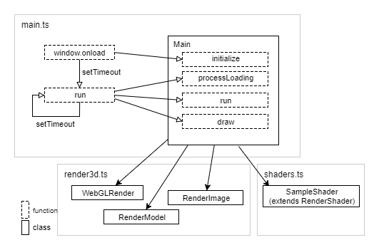

# TypeScriptによる基本的なWebGLプログラミング - Basic TypeScript-WebGL programming

## 概要

TypeScriptによる基本的なWebGL(1.0系)プログラムのサンプルです。このサンプルは他のサンプルの基礎となる要素を含んでいます。

ソースコード

- [サンプルプログラム（main.ts）](./main.ts)  
- [WebGL関連のクラス（render3d.ts）](../tips_core/render3d.ts) 

デモの実行

- [Live Demo](https://warotarock.github.io/ptw_tips/tips/basic_webgl_ts/)


## TypeScriptによるWebGLプログラミング

TypeScryptを使用すると、静的型チェックやオブジェクト指向プログラミングといった便利な機能を利用してプログラミングができます。PTW TipsではTypeScryptの機能のうち、クラス、インターフェース、ジェネリクスの機能を積極的に使用しています。


## サンプルプログラム

まずサンプルプログラム構成の全体像を示し、次におおまかな処理の流れを説明し、最後に処理の中で使用される各クラスを一つずつ説明します。

### プログラム構成



サンプルプログラムはsetTimeout関数による無限ループを起点として、MainクラスのprocessLoading関数、run関数、draw関数が繰り返し呼び出されることで実行されます。

WebGLレンダラやシェーダ、モデル、イメージといったクラスは全てMainクラスのクラスメンバ変数です。

### 処理の流れ１(初期化～画像ファイルの読み込み終了まで)

1. 初期化処理とロードの開始
    1. キャンバスのサイズ調整
    2. WebGLコンテキストの取得
    3. シェーダの初期化
    4. モデルのバッファの作成（モデルデータはコード中に記述）
    5. 画像ファイルの読み込み開始
       
2. 読み込み処理ループ
    1. テクスチャのバッファの作成(画像の読み込み終了イベント)
    2. 読み込み終了の判定

3. 読み込み後処理
    1. 読み込み終了フラグをtrueに設定

### 処理の流れ２(メイン処理、描画処理)

1. メイン処理ループ
    1. アニメーション時刻の計算
    2. カメラの位置の計算
    3. 描画するオブジェクトの位置と行列の計算

2. 描画処理(メイン処理後に実行)
    1. カメラの位置と注視点からプロジェクション行列を計算
    2. 描画パラメータの設定(深度テスト、カリングのOn/Off)
    3. 描画先のクリア
    4. オブジェクトのモデルの描画

## クラスの解説


### モデル(RenderModel)

主な目的

- ３Ｄモデルのバッファオブジェクトを保持する
- 描画時に必要なその他の情報を保持する

RenderModelクラスの主な目的は３Ｄモデルの頂点とインデックスのバッファオブジェクトを保持することです。これにより、３Ｄモデルを利用する側でそれぞれのバッファへの参照を一つずつ持たずにすみます。また、バッファを解放しても３Ｄモデルへの参照を保持することができ、再度バッファを作成しても参照を更新する必要がなくなります。これは、シーン遷移の多いゲームなど、リソースの確保と解放を繰り返し行う必要がある場合に有効でしょう。

RenderModelクラスは描画の際に必要となる、バッファに関連する情報も保持します。たとえば、頂点データの全体の要素数や一要素のサイズなどがあります。

バッファにセットした頂点データやインデックスデータも保持しています。これらはバッファにセットした後は使用しませんので、不要であれば解放してもかまいません。


### イメージ(RenderImage)

主な目的

- テクスチャオブジェクトを保持する
- 描画時に必要なその他の情報を保持する

RenderImageクラスの目的はWebGLのテクスチャオブジェクトを保持することです。対象がテクスチャであること以外、基本的な考え方はRenderModelと同じです。


### シェーダ(SanmpleShader、RenderShader)

主な目的

- WebGLProgramなどシェーダに関するオブジェクトを保持する
- WebGLを操作する関数を提供する
- 疑似差分プログラミングを可能にする

SanmpleShaderクラスはシェーダの基本クラスであるRenderShaderクラス(render3d.tsで定義)を継承して作成したクラスです。これらシェーダクラスの主な目的は上記の通り三つありますが、一つめはモデルやイメージと同じであるためここでの説明は省略し、他の二つについて説明します。


#### WebGLを操作する関数を提供する

シェーダクラスはシェーダに依存するパラメータをWebGLコンテキストに設定する機能を提供します。たとえばシェーダによっては頂点データとインデックスデータの他に、ライトの向きや色などといった追加の情報が必要になるため、それらを設定するための関数を提供します。ゲームシステム側からシェーダを操作する場合もあるため、できるだけWebGLの部分は隠ぺいする形をとったほうが保守性の面で良いでしょう。

RenderShaderには、全てのシェーダで共通する処理のための機能を実装してあります。たとえばattribute変数は、変数ごとにenableVertexAttribArray関数を使ってＧＰＵのレジスタを有効化する必要があります。また、必要がなくなればdisableVertexAttribArray関数を使って無効化する必要があります。この処理はRenderShaderクラスの基本機能として用意しています。  


#### 疑似的差分プログラミング

下記のサンプルをもとに説明します。GLSL ES 1.0には差分プログラミングの機能はありませんので、疑似的な方法です。

```
class SampleShader extends RenderShader {

    aPosition = -1;
    aTexCoord = -1;

    uTexture0: WebGLUniformLocation = null;

    initializeVertexSourceCode() {

        this.vertexShaderSourceCode = ''
            + this.floatPrecisionDefinitionCode

            + 'attribute vec3 aPosition;'
            + 'attribute vec2 aTexCoord;'

            + 'uniform mat4 uPMatrix;'
            + 'uniform mat4 uMVMatrix;'

            + 'varying vec2 vTexCoord;'

            + 'void main(void) {'
            + '	   gl_Position = uPMatrix * uMVMatrix * vec4(aPosition, 1.0);'
            + '    vTexCoord = aTexCoord;'
            + '}';
    }

    initializeFragmentSourceCode() {

        this.fragmentShaderSourceCode = ''
            + this.floatPrecisionDefinitionCode

            + 'varying vec2 vTexCoord;'

            + 'uniform sampler2D uTexture0;'

            + 'void main(void) {'
            + '    gl_FragColor = texture2D(uTexture0, vTexCoord);'
            + '}';
    }

    initializeAttributes(gl: WebGLRenderingContext) {

        this.initializeAttributes_RenderShader(gl);
        this.initializeAttributes_SampleShader(gl);
    }

    initializeAttributes_SampleShader(gl: WebGLRenderingContext) {

        this.aPosition = this.getAttribLocation('aPosition', gl);
        this.aTexCoord = this.getAttribLocation('aTexCoord', gl);

        this.uTexture0 = this.getUniformLocation('uTexture0', gl);
    }

    setBuffers(model: RenderModel, images: List<RenderImage>, gl: WebGLRenderingContext) {

        gl.bindBuffer(gl.ARRAY_BUFFER, model.vertexBuffer);

        this.enableVertexAttributes(gl);
        this.resetVertexAttribPointerOffset();

        this.vertexAttribPointer(this.aPosition, 3, gl.FLOAT, model.vertexDataStride, gl);
        this.vertexAttribPointer(this.aTexCoord, 2, gl.FLOAT, model.vertexDataStride, gl);

        gl.bindBuffer(gl.ELEMENT_ARRAY_BUFFER, model.indexBuffer);

        gl.activeTexture(gl.TEXTURE0);
        gl.bindTexture(gl.TEXTURE_2D, images[0].texture);
        gl.uniform1i(this.uTexture0, 0);
    }
}
```

SampleShaderクラスはRenderShaderクラスを継承しています。RenderShaderにはいくつかの基本的な機能だけが含まれており、シェーダ個性が決まるような機能は継承先のクラスで関数をオーバーライドして実装します。

SampleShaderクラスではinitializeVertexSourceCode関数とinitializeFragmentSourceCode関数をオーバーライドし、それぞれ頂点シェーダとフラグメントシェーダのソースコードの文字列を初期化しています。シェーダのソースコードが関数内に組み込まれているのは、WebGLのサンプルプログラムとしては珍しいかもしれません。しかし関数になっていることで、クラスの機能を使って、変更したい部分だけを記述して新たなシェーダクラスを作ることができます。例えば上記のサンプルでもソースコードに変数を使用しています。

```
    initializeVertexSourceCode() {

        this.vertexShaderSourceCode = ''
            + this.floatPrecisionDefinitionCode // 変数を使用している

            + 'attribute vec3 aPosition;'
            ...
```


また、SampleShadeクラスではinitializeAttributes関数内でattribute変数やuniform変数の取得を行っています。こちらもシェーダのソースコードと同様に、クラスの作り方しだいで差分だけを記述することができます。例えば次のように、継承元クラスの関数と新しく作成した関数をそれぞれ呼び出すことで実現できます。

```
    initializeAttributes(gl: WebGLRenderingContext) {

        this.initializeAttributes_RenderShader(gl); //継承元クラスの関数
        this.initializeAttributes_SanmpleShader(gl); //このクラスの関数
    }
```


## レンダラ(WebGLRender)

主な目的
- WebGLコンテキストをラップし保守性を高める
- WebGLのステート管理を補助する

WebGLRenderクラスの主な目的はWebGLコンテキストをクラスでラップすることです。これはプログラムの保守性を高める意味で有効です。

また、WebGLを扱うとき重要なこととして、WebGLがステートマシンであるという事情があります。しかも、必ずしも現在の状態の全ての情報を取得できるように設計されているわけではありません。WebGLコンテキストやGPUの状態をプログラム側で記憶しておく必要があったり、そのほうが高速に処理できる場合もあります。

例えばWebGLRenderクラスではenableVertexAttribArray関数によって有効にされたレジスタの中で使用しないレジスタを無効にする処理をsetShader関数の中で行っています。またWebGLRenderクラスは、現在のシェーダがどれであるかを記憶するメンバ変数を持っています。


## 余談

#### RenderModelへの機能追加時の注意点

将来的にRenderModelに機能を追加するときは、描画に直結する情報だけを持たせるようにしたほうが良いと筆者は考えます。たとえば３Ｄモデルのファイル名などの情報はこのRenderModelに持たせるべきではありません。ファイル名は描画に直接関係がない情報であり、描画処理では使用しないからです。そういった情報はRenderModelを内包する、例えば "ModelResource" のような名称のクラスに持たせるとよいでしょう。そのクラスであれば、描画に関係のない、例えばゲーム的な要素に関係する情報を持たせてもよいことになります。


#### インターリーブ配列による頂点バッファ

WebGLを学習するためのサンプルプログラムの多くでは頂点座標、法線、ＵＶといった頂点情報に別々のバッファを作成する方法を取っています。それには種々の背景があると思われますが、PTW Tipsのサンプルでは全ての頂点情報を一つのインターリーブ配列にまとめ、一つのバッファを作成する方法をとっています。

インターリーブ配列を使用する理由の一つは、一般的にパフォーマンス面で有利であるといわれているからです。

また別の理由として、インターリーブ配列にしたほうが実行時の処理がシンプルになる、というものがあります。もしインターリーブ配列を用いない場合は、３Ｄモデルに頂点座標、法線、ＵＶの情報がある場合、バッファを処理する３つの同じようなコードが必要になります。もし接線と頂点色の情報も追加することになった場合には、さらに２つのコードが必要となります。また、シェーダも修正が必要です。一方でインターリーブ配列を用いると、どれだけ情報が増えてもバッファを処理するコードは１つのままで、シェーダを修正するだけで済みます。

ただし、インターリーブ配列を用いるには、３Ｄモデルのデータをはじめからインターリーブ配列にしやすい形にしておく必要があります。つまり実行時の処理はシンプルになりますが、３Ｄモデルのデータを作成する処理は複雑になります。これはトレードオフの関係といえますが、筆者は実行速度とメンテナンス性を考えてインターリーブ配列を用いることにしています。


#### 接頭辞について

筆者は以下のルールで接頭辞（prefix）を付けた変数名を使用しています。

- uniform変数は u から始める
- attribute変数は a から始める
- varying変数は v から始める
- JavaScript側も同じ変数名にする

接頭辞を付ける理由は、たとえばＵＶ座標のように、attribute変数をそのままvarying変数に渡すだけで済む場合があるためです。例えばaTexCoordとvTexCoordは本来同じものを意味するものですが、GLSLの仕様上、違う名前でそれぞれ用意する必要があります。さらに、TypeScript(JavaScript)側でも変数を持つ必要がありますので、筆者はこれらは同じものであることが分かるように、かつ簡単に区別がつくよう接頭辞を付けることにしました。

また、以下のような事情も背景としてあります。

- attribute、uniform、varyingという単語が接頭辞や接尾辞としては長すぎる
- WebGLの普及し始めの頃、googleやmozillaが公開したチュートリアルの多くで同様の変数名が用いられていた