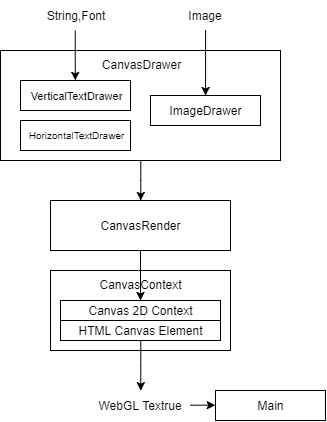

# キャンバス描画（文字列描画） - Canvas drawing (for text drawing)

## 概要
※作成途中です

文字列の描画など、描画処理の中にはWebGLで実現するよりもキャンバス（HTMLのcanvas要素）で実現したほうが簡単なものがあります。ここでは文字列の描画を主な目的とし、キャンバス描画とWebGLの連携について説明します。

ソースコード

- [サンプルプログラム（main.ts）](./main.ts)
- [２Ｄ描画ラッパークラス（render2d.ts）](../tips_core/render2d.ts)
- [キャンバス描画（canvas_drawer.ts）](../tips_core/canvas_drawer.ts)


## キャンバス描画

### キャンバスによる描画とWebGL

キャンバスを使用すると様々な２次元の描画処理が行えます。直線や曲線、円、グラデーションなどの描画が可能です。さらに、文字列の描画はアンチエイリアスの適用された高品質な結果を得られます。

キャンバスの描画結果は画像データとして取り出すことができます。キャンバスをWebGLの texSubImage2D関数に渡すことでキャンバスの画像データをWebGLのテクスチャにコピーできます。次のコードはテクスチャにキャンバスの内容をコピーする関数の例です。(参考：[render3d.ts](../tips_core/render3d.ts))

```
    setTextureImageFromCanvas(image: RenderImage, canvas: HTMLCanvasElement) {

        var gl = this.gl;

        gl.bindTexture(gl.TEXTURE_2D, image.texture);

        gl.texSubImage2D(gl.TEXTURE_2D, 0, 0, 0, gl.RGBA, gl.UNSIGNED_BYTE, canvas);

        gl.bindTexture(gl.TEXTURE_2D, null);
    }
```


### 再描画の抑制

キャンバスの大きさにも依存しますが、テクスチャに画像データをコピーする処理は他のWebGLの描画処理と比べ比較的時間のかかる処理です。また、キャンバスによる文字列描画にも時間がかかります。そのためゲームの描画処理ではあらかじめビットマップフォントを用意するなどして高速に文字列を描画する手法が用いられることがあります。

一方で、文字列の内容に変化が無いかぎりは描画を繰り返す必要が無い場合も多くあります。例えば日本語での説明文や、プレイヤーキャラクターの名前などです。これらは画面の同じ位置に同じ文字が表示され続けるか、スクロールなどで位置だけが変化する場合がほとんどでしょう。

そのような場合には、文字列が表示される最初の１回と変更があったときだけ描画処理を行い、結果をWebGLのテクスチャに保存しておくことで文字列の描画処理の頻度を軽減することができます。このサンプルプログラムではキャンバス描画(CanvasDrawer)にそのための機能が実装されています。


### 文字列描画の位置決め

- 描画部分の高さの計測とアラインメント
    - 縦方向の中央寄せ
    - 横方向の中央寄せ
- 日本語の縦書き
    - 縦書きは英語に対応しない

## サンプルプログラム

### プログラム構成




## 関連情報
- [TypeScriptによる基本的なWebGLプログラミング](./basic_webgl_ts/)
