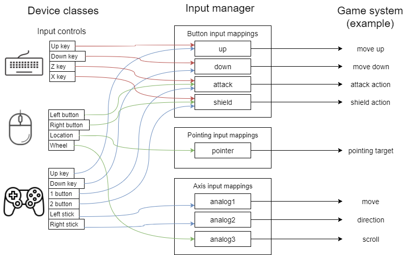

# 入力管理 - Input management

## 概要

複数種類のデバイス（キーボード、マウス、ゲームパッド）入力のゲームへの利用についての解説とサンプルプログラムです。なお、ここではGUIは扱いません。

ソースコード

- [サンプルプログラム（main.ts）](./main.ts)
- [入力マネージャ（input.ts）](../tips_core/input.ts)
- [マウス（input_mouse.ts）](./input_mouse.ts)
- [キーボード（input_keyborad.ts）](./input_keyborad.ts)
- [ゲームパッド（input_gamepad.ts）](./input_gamepad.ts)


## 入力管理

ユーザからの入力をゲームに伝えるためには、まずキーボードやマウスといった入力デバイスからAPIを通じて情報を取得する必要があります。また、複数のデバイスが同時に利用可能である場合には、デバイスごとや入力の種類ごとに優先順位をつけてユーザからの入力をゲームに伝える必要があります。

サンプルプログラムでは、キーボード、マウス、ゲームパッドの３つのデバイスがユーザからの入力を取得します。そして入力マネージャを通して各デバイスからの入力を取得することで、簡単なゲームを想定した入力形式（十字ボタン、攻撃ボタン、防御ボタンなど）に統合された状態で入力値を利用します。


### キーワード

|単語|説明|
|:-----------------|:-------------------------|
|デバイス|キーボード、マウス、ゲームパッドなどの入力デバイス。|
|入力コントロール|キーボードのボタン、マウスの位置、ゲームパッドのスティックといった入力デバイスのもつ入力単位の総称 。フォームコントロールのような意味。|
|入力マッピング|複数デバイスからの入力をゲーム側で利用する形に変換し、割り当てを行い出力すること。それを行うクラス。|
|入力管理|ここでは特にゲーム向けに整理された方法で入力をうまく扱うこと。|
|入力マネージャ|入力管理を実装したもの。|


## サンプルプログラム

### プログラム構成

下の図は全てのデバイスとマッピングが構成され終わった後の状態の例を示しています。

各種デバイスクラスは各種入力コントロールを持っています。入力コントロールにはボタン入力、アクシズ入力、ポインタ入力の３つの種類があります。入力コントロールは入力マネージャの対応する種類のマッピングに登録されています。一つのマッピングには複数のコントロールが登録でき、最後に入力のあったコントロールがそのマッピングの出力となります。そしてゲームシステムは、ゲームの操作に必要な入力をマッピングを通して取得します。




### 処理の流れ

1. デバイスの初期化
2. マッピングの作成
3. コントロールとマッピングの関連付け
4. ループ処理
    1. ポーリングが必要なデバイスのポーリング処理
    2. マッピングの出力の更新（最後に入力のあったコントロールが優先されます）
    3. （ゲームシステムのメイン処理）
    4. フラグの更新処理


### デバイス(KeyboardDevice、MouseDevice、GamepadDevice)

キーボード、マウス、ゲームパッドといったデバイスからＡＰＩを通じて入力を受け取り、コントロールに出力するクラスです。

これらのクラスはIInputDeviceインターフェースを実装したクラスです。入力マネージャはこのIInputDeviceインターフェースを実装したクラスを受け取り決められた関数を呼び出すことで、様々なデバイスを統合して扱うことができます。

デバイスの行う処理の内容はそのデバイスしだいですが、最終的には、次から説明する3種類の入力コントロールに設定された値だけがデバイスの出力となります。


### ボタン入力コントロール(ButtonInputControl)

サポートする入力値
- 押下状態を検出
    - 解放状態
    - 解放になった瞬間
    - 押下になった瞬間
    - 押下状態
- ダブルクリック状態
    - 解放状態
    - ダブルクリックになった瞬間

ボタン入力の状態を扱うコントロールです。想定しているのは、キーボードからのキー入力、マウスのボタン入力、ゲームパッドのボタン入力です。これらの入力は一般的に４つの押下状態として扱います。また、マウスのダブルクリック（短時間に２回ボタンを押下する操作）も同時に検出します。


### アクシズ入力(アナログ入力)コントロール(AxisInputControl)

サポートする入力値
- X値（浮動小数）
- Y値（浮動小数）

アナログ入力の状態を扱うコントロールです。想定しているのは、ゲームパッドのアナログスティックによる入力です。アナログスティックの傾きを表すX, Yの２値としてゲームパッドから取得されます。


### ポインタ入力コントロール(PointingInputControl)

サポートする入力値
- X座標（浮動小数）
- Y座標（浮動小数）

位置情報を扱うコントロールです。想定しているのは、マウスの位置やタッチ入力のタッチ位置です。これはX座標, Y座標として取得されます。


### 入力マッピング(InputMapping、InputMappingSet)

InputMappingは複数の入力コントロールを統合するためのクラスです。

統合とは、例えば、キーボードのＺキーとゲームパッドの１ボタンのどちらでもゲームにおける"attack"の操作にするなどです。一つのデバイスから複数の入力を同じボタンに割り当てることも可能です。

InputMappingSetは複数のInputMappingに名前をつけて集合として扱うためのクラスです。この名前が統合コントロールの名前そのものになります。


### 統合コントロール(IntegratedButtonControl、IntegratedAxisControl、IntegratedPointingInputControl)

マッピングにより統合された結果をゲームシステム側で利用するためのクラスです。

InputManager.addButton関数などの戻り値として取得されます。内部に入力マネージャ内の入力マッピングへの参照を保持しているため、このクラスの実体を通すことで、入力マネージャの更新処理の結果を取得することができます。


### 入力マネージャ(InputManager)

デバイスのポーリング処理や更新処理の一括実行、入力マッピングの更新処理を行うクラスです。

JSONを受け取ってマッピングをカスタマイズする機能もあります。先に記述されたデバイスのコントロールが優先され、同じデバイス内であれば先に記述されたコントロールが優先されます。以下はJSONの記述例です。

```
config: List<PTWTipsInput.DeviceInputMappingConfig> = [
    {
        deviceName: 'keyboard',
        mappings: [
            [' ', 'start',],
            ['Enter', 'start'],
            ['ArrowUp', 'up'],
            ['ArrowRight', 'right'],
            ['ArrowDown', 'down'],
            ['ArrowLeft', 'left'],
            ['w', 'up'],
            ['d', 'right'],
            ['s', 'down'],
            ['a', 'left'],
            ['z', 'attack'],
            ['j', 'attack'],
            ['x', 'shield'],
            ['k', 'shield'],
        ]
    },
    {
        deviceName: 'mouse',
        mappings: [
            ['button1', 'attack'],
            ['button3', 'shield'],
            ['location', 'pointer'],
            ['wheel', 'analog3'],
        ]
    },
    {
        deviceName: 'gamepad',
        mappings: [
            ['crossButton1', 'up'],
            ['crossButton2', 'right'],
            ['crossButton3', 'down'],
            ['crossButton4', 'left'],
            ['button1', 'attack'],
            ['button2', 'shield'],
            ['button10', 'start'],
            ['stick1', 'analog1'],
            ['stick2', 'analog2'],
        ]
    }
];
```


## 関連情報

特になし
