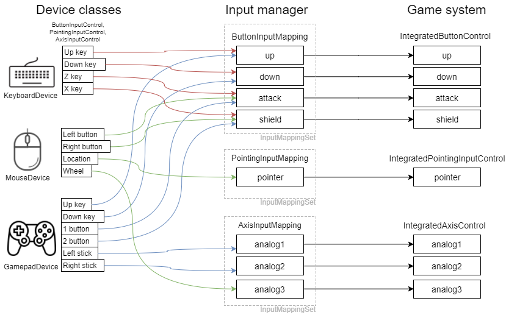

# 入力管理 - Input management

## 概要

※作成途中です

複数種類のデバイス（キーボード、マウス、ゲームパッド）からの入力をゲームへの入力として統合するしくみについての説明とサンプルプログラムです。なお、ここではGUIは扱いません。

ソースコード
- [サンプルプログラム（main.ts）](./main.ts)
- [入力マネージャ（input.ts）](../tips_core/input.ts)
- [マウス（input_mouse.ts）](./input_mouse.ts)
- [キーボード（input_keyborad.ts）](./input_keyborad.ts)
- [ゲームパッド（input_gamepad.ts）](./input_gamepad.ts)

## 入力管理

ユーザからの入力をゲームに伝えるためには、まずキーボードやマウスといった入力デバイスからAPIを通じて情報を取得する必要があります。また、複数のデバイスが同時に利用可能である場合には、デバイスごとや入力の種類ごとに優先順位をつけてユーザからの入力をゲームに伝える必要があります。

サンプルプログラムでは、キーボード、マウス、ゲームパッドの３つのデバイスがユーザからの入力を取得します。そして入力マネージャを通して各デバイスからの入力を取得することで、簡単なゲームを想定した入力形式（十字ボタン、攻撃ボタン、防御ボタンなど）に統合された状態で入力値を利用します。

### キーワード

|単語|説明|
|:-----------------|:-------------------------|
|デバイス|キーボード、マウス、ゲームパッドなどの入力デバイス。|
|入力コントロール|キーボードのボタン、マウスの位置、ゲームパッドのスティックといった入力デバイスのもつ入力単位の総称 。フォームコントロールのような意味。|
|入力マッピング|複数デバイスからの入力をゲーム側で利用する形に変換し、割り当てを行い出力すること。それを行うクラス。|
|入力管理|ここでは特にゲーム向けに整理された方法で入力をうまく扱うこと。|
|入力マネージャ|入力管理を実装したもの。|

## サンプルプログラム

### プログラム構成

上の図は全てのデバイスとマッピングが構成され終わった後の状態の例を示しています。

各種デバイスクラスは各種入力コントロールを持っています。入力コントロールにはボタン入力、アクシズ入力、ポインタ入力の３つの種類があります。入力コントロールは入力マネージャの対応する種類のマッピングに登録されています。一つのマッピングには複数のコントロールが登録でき、最後に入力のあったコントロールがそのマッピングの出力となります。そしてゲームシステムは、ゲームの操作に必要な入力をマッピングを通して取得します。

### デバイスクラス

クラス：KeyboardDevice、MouseDevice、GamepadDevice

キーボード、マウス、ゲームパッドといったデバイスからＡＰＩを通じて入力を受け取り、コントロールに出力するクラスです。

これらのクラスはIInputDeviceインターフェースを実装したクラスです。入力マネージャはこのIInputDeviceインターフェースを実装したクラスを受け取り決められた関数を呼び出すことで、様々なデバイスを統合して扱うことができます。

デバイスの行う処理の内容はそのデバイスしだいですが、最終的には、次から説明する各種の入力コントロールに設定された値がデバイスの出力となります。

### ボタン入力コントロールクラス

クラス：ButtonInputControl

サポートする入力値
- 押下状態を検出（解放状態、解放になった瞬間、押下になった瞬間、押下状態）
- ダブルクリック状態（解放状態、ダブルクリックになった瞬間）を検出

ボタン入力の状態を扱うコントロールです。想定しているのは、キーボードからのキー入力、マウスのボタン入力、ゲームパッドのボタン入力です。これらの入力は一般的にボタンの押下状態として考えることができます。また、マウスボタンの操作方法としてダブルクリックもあります。

### アクシズ入力(アナログ入力)コントロールクラス

クラス：AxisInputControl

サポートする入力値
- X値（浮動小数）
- Y値（浮動小数）

アナログ入力の状態を扱うコントロールです。想定しているのは、ゲームパッドのアナログスティックによる入力です。アナログスティックの入力はスティックの傾きを表すX, Yの２値としてゲームパッドから取得されます。

### ポインタ入力コントロールクラス

クラス：PointingInputControl

サポートする入力値
- X座標（浮動小数）
- Y座標（浮動小数）

位置情報を扱うコントロールです。想定しているのは、マウスの位置やタッチ入力のタッチ位置です。これはX座標, Y座標として取得されます。

### 入力マッピングクラス

複数の入力コントロールを統合する役割をするクラスです。

なお、一つのデバイスから複数の入力を同じボタンに割り当てることも可能です。

Jsonを受け取ってカスタマイズ可能です。その場合のマッピングの優先順は登録順です。先に登録されたデバイスのコントロールが優先され、同じデバイス内であれば先に登録されたコントロールが優先されます。

### 入力マネージャクラス

デバイスの一括実行、マッピング処理を行うクラスです。

## 関連情報

特になし
