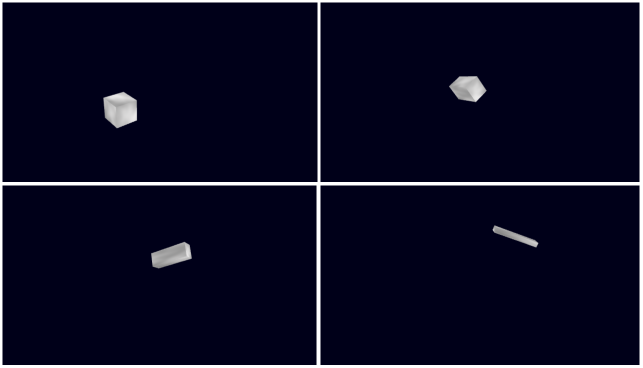

# オブジェクトアニメーションの再生 - Object animation drawing

## 概要

※削除予定です

Blenderのオブジェクトアニメーションのコンバート処理結果のデータの利用例です。

アニメーションの計算はtips_coreフォルダの animation.tsを使用します。

ソースコード

- [サンプルプログラム（main.ts）](./main.ts)  
- [アニメーション（animation.ts）](../tips_core/animation.ts)  

デモの実行

- [Live Demo](https://warotarock.github.io/ptw_tips/tips/object_animation_drawing/)

## 関連情報

- [オブジェクトアニメーションデータの作成](../object_animation_converter/) 
- [モデルの描画](../basic_model_drawing/)
