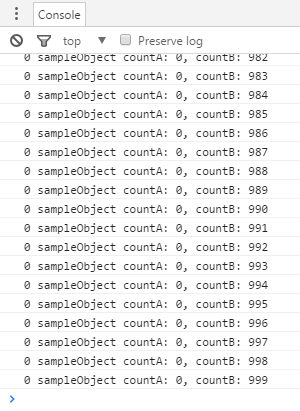

# オブジェクト・プーリング - Object pooling

## 概要
メモリ管理手法であるオブジェクト・プーリングのTypeScriptでの実装について説明します。

ソースコード

- [サンプルコード main.ts](./main.ts)
- [リサイクル処理 recycling.ts](../tips_core/recycling.ts)



## オブジェクト・プーリング
オブジェクト・プーリングは、メモリの断片化やガーベージコレクションの発生によるパフォーマンスの低下を解決したり軽減するための手法です。ゲーム「トリノワールド」では描画オブジェクトや弾、エフェクト等のために使用しています。

基本的な考え方は、オブジェクトを再利用することでオブジェクトの生成や解放を減らすことです。アルゴリズムとしては次のようになります。

- 先に必要数のオブジェクトをまとめて生成し、プール（リストや配列）に入れておく
- 新しいオブジェクトはプールから取得する
- 不要になったオブジェクトはプールに返却する
- プールを破棄するときオブジェクトをまとめて破棄する

## TypeScriptによるプールの実装

### RecyclePool&lt;T&gt;

TypeScriptのジェネリクスの機能を利用した基本クラス RecyclePool&lt;T&gt; が [recycling.ts](../tips_core/recycling.ts) にあります。このクラスを使うと、クラスと個数を指定してプールを生成できます。

プールの生成はC#など他の言語と比べ若干特殊な記述になるため、次の例で説明します。

```recycling.ts
var sampleObjectPool = new RecyclePool<SampleObject>(SampleObject, 50);
```
これは容量50のSampleObjectのプールを生成するコードです。new RecyclePoolの後にTypeScriptの型情報として&lt;SampleObject&gt;を記述し、かつコンストラクタの引数にSampleObject（JavaScriptの関数オブジェクト）を与えています。コンストラクタに与えられたSampleObjectは、プール内部でオブジェクトを生成する際、newをする関数オブジェクトとして使用されます。

なお、RecyclePool&lt;T&gt; の T には IRecyclableObject インターフェースを実装したクラスを指定できます。
そのため recycleIndex と recycle関数 を持つクラスであれば、どんなクラスでも指定できます。

### IRecyclableObject

```ts:recycling.ts
interface IRecyclableObject {
    recycleIndex: int;
    recycle();
}
```


recycleIndex は RecyclePool が再利用処理を効率よく行うための変数です。この変数はRecyclePool以外の場所では使用しないようにしてください。

recycle関数はオブジェクトを初期化するために RecyclePool から実行される関数です。この関数に各クラスの固有の初期化処理を記述することになります。

## サンプルコード
サンプルコードではSampleObjectクラスをオブジェクト・プーリングの対象とし、プールからオブジェクトを取り出し、メンバ変数を変更し、すぐにオブジェクトを破棄（再利用）する処理を1000回繰り返します。

```ts:main.ts
class SampleObject implements IRecyclableObject {

    recycleIndex: int;
    recycle() {

        this.countA = 0;
    }

    countA = 0;
    countB = 0;
}

class Main {

    run() {

        var sampleObjectPool = new RecyclePool<SampleObject>(SampleObject, 50);

        for (var i = 0; i < 1000; i++) {

            var sampleObject = sampleObjectPool.get();

            if (sampleObject == null) {
                return;
            }

            console.log(sampleObject recycleIndex + ' sampleObject1.countA: ' + sampleObject.countA + ', countB: ' + sampleObject.countB);

            sampleObject.countA++;
            sampleObject.countB++;

            sampleObjectPool.recycle(sampleObject);
        }

        sampleObjectPool.free();
    }
}
```

SampleObjectにはcountA、countBというメンバ変数があります。countAはrecycle関数に0を代入している記述がありますがcountBはありません。

実行すると、countAはオブジェクトが再利用されるたびにrecycle関数内で0に初期化されるため、コンソールには常に0が出力されます。

一方でcountBは加算され続け、コンソールには最終的に999が出力されます。プールからオブジェクトを取り出す処理は1000回行われても、実際に使用されるオブジェクトはプール内の最初の１つだけであり、再利用されていることが分かります。


