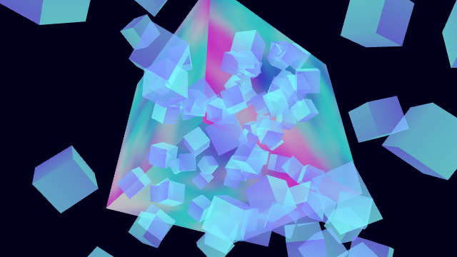
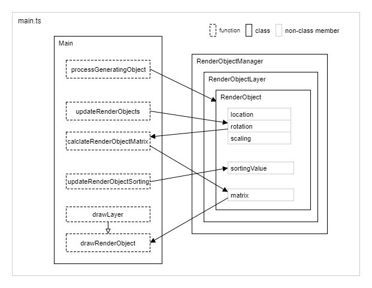

# 描画オブジェクト管理 - Render object management

## 概要
三次元空間に配置されたオブジェクトを表現し描画するための一つの方法として、
「描画オブジェクト」について説明します。

ソースコード
- [サンプルプログラム（main.ts）](./main.ts)  
- [描画オブジェクトマネージャ（game_render_object_manager.ts）](../tips_core/game_render_object_manager.ts)

デモの実行

- [Live Demo](https://warotarock.github.io/ptw_tips/tips/render_object_management/)

 

## 描画オブジェクト管理

### 描画オブジェクト
３次元空間に配置されたなんらかのオブジェクトを描画するには、描画対象の位置や回転、スケーリングといった、いくつかの情報が必要となります。また、それらの情報を保持するための変数や座標変換行列の変数が必要になります。

筆者は描画に必要な多くの変数をあらかじめ持ったオブジェクトを「描画オブジェクト」として共通して管理するようにしています。共通にすることで、次の項から説明するような機能をゲームシステムのどこからでも共通に利用可能になります。

描画オブジェクトに持たせる情報は開発するゲームの特性に合わせて積極的にカスタマイズします。例えば描画に関するパラメータとして不透明度が必要であれば追加してよいでしょう。その場合、追加したプロパティを初期化するコードを再利用処理に追加することを忘れずに行いましょう。

 

### オブジェクト・プーリング

描画オブジェクトの生成と解放はオブジェクト・プーリングで行います。つまり必要に応じて生成解放するのではなく、例えばゲーム開始時などに一度にまとめて生成し、ゲーム中では何度も同じオブジェクトを再利用します。これにより実行時のメモリ確保を減らすとともに、ガーベージコレクションにより実行が不安定になることを防ぎます。（参考：[オブジェクト・プーリング](./object_pooling/)）

 

### レイヤー

ゲームでは多くの場合、描画処理は何回かの段階に分けて実行されます。例えばまず背景をまとめて描画し、その後、前景をまとめて描画します。レイヤーはこのようにまとめて描画するオブジェクトを管理するための機能です。

 

### 奥行きソート

半透明オブジェクトを奥から順に描画するために、カメラから見た奥行きでソートする
ための機能です。

 

## サンプルプログラム

### プログラム構成

上の図はクラスと関数の呼び出し関係を表しています。

※ここでは説明の順序の都合上、レイヤーに関連する部分は省略されています。レイヤーに関連する部分については後述します。

まずメイン処理のprocessGeneratingObject関数で描画オブジェクト(RenderObject)が作成されます。このときオブジェクトの位置と回転がランダムに設定されます。作成された描画オブジェクトは描画オブジェクトマネージャに登録されます。

メイン処理では毎フレームごとにupdateRenderObjects関数が実行され、でオブジェクトの回転が更新されます。サンプルプログラムでは単純にオブジェクトを回転させているだけですが、ゲームなどではもっと複雑な処理になるでしょう。

メイン処理の終わりにcalclateRenderObjectMatrix関数が実行され、オブジェクトの位置、回転、スケーリングが適用された行列が計算されます。行列の計算は比較的計算負荷の大きい処理であるため、最後にまとめて計算するようにしています。

描画処理の前半ではupdateRenderObjectSorting関数が実行され、奥行きソートの基準となる値が計算され、描画オブジェクトに設定されます。

描画処理の後半ではレイヤーごとに描画を行います。描画オブジェクトマネージャにはレイヤーのＩＤを指定してオブジェクトのリストを取得する機能あります。このときソート済みの描画オブジェクトのリストが取得できます。

 

## 関連情報
- [モデルの描画](../basic_model_drawing/)
