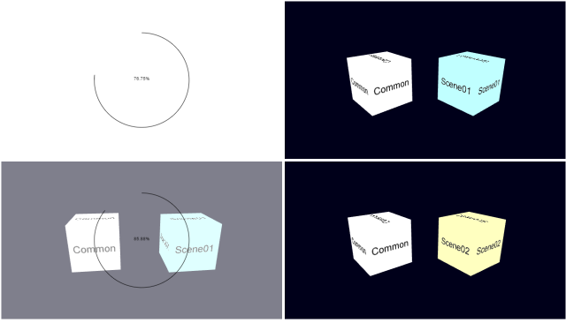
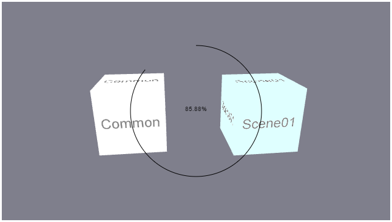
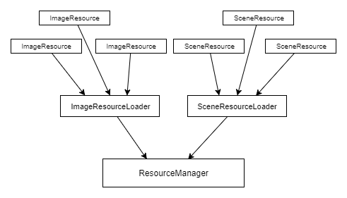

# リソース管理 - Resource management

## 概要

リソース（画像、バッファ、シーンデータ等）の読み込みと解放のしくみ、進捗表示の管理についての説明とサンプルプログラムです。 

ソースコード

- [サンプルプログラム（main.ts）](./main.ts)  
- [リソースマネージャ及び関連クラス（game_resource_manager.ts）](../tips_core/game_resource_manager.ts)



デモの実行

- [Live Demo](https://warotarock.github.io/ptw_tips/tips/resource_management/)

<br />

## リソース管理

WebGLの場合、リソースの管理の多くの部分はブラウザが行ってくれます。たとえばページの移動や再読み込みの時、ブラウザはWebGLのテクスチャやバッファなどを適切に解放してくれます。しかし、ページを移動しない画面遷移が多数ある場合や進捗状況を表示したい場合など、プログラム側でリソース管理を行ったほうがよい場合もあります。

サンプルプログラムはこのような場合のためのリソース管理を実装したものです。リソース管理には大きく次の３つの機能があります。ここからはそれぞれの機能について説明します。

- 必要リソースの読み込みと不要リソースの解放
- 並列読み込みと順次読み込みの制御
- 進捗状況の表示

<br />

### キーワード

|単語|説明|
|:-----------------|:-------------------------|
|リソース|プログラムの実行時に読み込まれたり確保されたりして利用されるもの。|
|リソースの種類|画像、バッファ、テクスチャなどがあります。|
|リソースマネージャ|リソース管理を実装したもの。|
|順次読み込み|非同期処理で同時に全てのファイルを読み込むのではなく、１～数件ずつファイルを読み込んでいくこと。|
|並列読み込み|非同期処理で同時にに２件以上のファイルを読み込むこと。|

<br />

### 必要リソースの読み込み、不要リソースの解放

画面遷移がある場合ーたとえば複数のステージがあるゲームなどでは、多くの場合は全てのリソースを一度に読み込むのではなく、ステージで必要となるものだけを読み込みます。ステージが切り替わるタイミングでまず不要となるリソースを解放し、メモリに空きを確保してから、必要となるリソースの読み込み処理を行うことになるでしょう。

このような処理を行うには、どのリソースがどの場面で必要となるか事前に分かっている必要があります。サンプルプログラムではプログラム中にどのリソースごとの設定を記述し、どのリソースがどの場面で必要となるか指示するようにしています。

<br />

### 並列読み込みと順次読み込みの制御

ほとんどのブラウザでは複数の画像ファイルの読み込みを同時に行う（並列読み込み）ことができます。しかしブラウザによっては同時に読み込み可能な数が限られていたり、ファイルの種類（テキストファイル、音声ファイルなど）によっては読み込みを並列して行えない場合があります。読み込み時間では若干不利になりますが、画像は２、３件程度ずつ、その他のファイルは１件ずつ、読み込みを行う（順次読み込み）と安全でしょう。

そのためにはまず必要となるリソースをリストアップし、１件あるいは数件ずつ順番に読み込みを行います。サンプルプログラムでは画像ファイルは最大３件を並列で読み込み、モデルデータのJSONファイルは１件ずつ順次読み込むようにしています。読み込みの順序はプログラム中に記述したリソースの設定の順序になります。

<br />

### 進捗状況の表示

リソースの読み込みに時間がかかる場合、進捗状況がわかるような表示を行うことがよくあります。一般的に、特定の端末や特定のネットワークでないかぎり、読み込みにかかる時間を事前に予測することは困難です。そのため下の図のように進捗を％で表示したり、線や帯などで進捗の割合を表示することがあります。



このような割合の表示を行うには読み込み対象のリソース全体の容量が事前に分かっている必要があります。さらに、リソースごとに読み込むファイルのサイズが異なる場合（ほとんどの場合はそうでしょう）は、ファイルのサイズまたは全体の容量に対する割合が事前に分かっている必要があります。

そのためサンプルプログラムではリソースの定義に所要時間の参考値(weight)を記述しています。参考値は標準的なサイズのリソースで1.0とし、大きいリソースではそれより大きな値にしています。

進捗の割合の計算は順次読み込みの処理の中で行われ、画面に表示されます。実はこのとき、画面の表示は実際の進捗状況をそのまま表示しているありません。なめらかなアニメーションになるように補間処理がされています。実際の進捗とあまりに違うものでなければ、順調に読み込みが行われているように見えた方が印象が良い、と筆者は思い工夫してみたのですが、いかがでしょうか。

<br />


## サンプルプログラム

### プログラム構成



サンプルプログラムは、１つのマネージャクラス、２種類のローダクラス、そして２種類のリソースクラスで構成されます。マネージャクラスはローダを統括する役割を持ちます。ローダクラスはリソースの種類ごとに実装され、リソースの読み込み処理を行う役割を持ちます。各種リソースクラスはファイル名やリソースのデータ本体を保持します。

リソースクラスやローダクラスにはそれぞれ継承元のクラスがあります。マネージャクラスはそれら継承元のクラスの関数やプロパティを使用して動作するため、リソースの種類が増えてもマネージャクラスを修正する必要はありません。

なお、基本的な描画に関する処理は[モデルの描画](../basic_model_drawing/)と同様です。

<br />

### 処理の流れ

1. 設定の構築
    1. リソース(ImageResource、SceneResourceのリスト)を生成
    2. ローダを生成し、ローダにリソースを登録
    3. ロード制御情報を生成
    4. リソースマネージャにローダとロード制御情報を登録

2. 読み込みの開始
    1. リソースマネージャによるロード開始処理の実行

3. 読み込み処理ループ
    1. ローダ毎、リソース毎に順次読み込み処理の実行、待ち処理
    2. 進捗表示
    3. 全てのロードが終了したらループを終了

<br />

## クラスの解説

### リソース(ImageResource、SceneResource)

リソースのファイル名などの設定、リソース本体データへの参照を保持するためクラスです。ResourceItemを継承しています。

なお、サンプルプログラムにはModelResourceクラスも存在しますが、これはシーンリソースの中に含まれているデータを分解したものです。ロードや解放はシーンリソースの処理の一部として行われます。

#### リソースの設定の記述について

サンプルプログラムではリソースのファイル名などの設定をプログラム中に記述しています。ゲーム内で使用されるリソースが動的に増減しないのであれば、これでほとんどの場合に対応できるでしょう。また、コンパイル時に不整合の検出ができる可能性もあります。

記述の例を次に示します。なお、リソースの数が多い場合はこれらの記述をジェネレートするプログラムを作成するのも良い方法でしょう。

```
// Image resource settings
var imageResources = new List<ImageResource>(ImageResourceID.MaxID + 1);

imageResources[ImageResourceID.None] = new ImageResource();
imageResources[ImageResourceID.Image00] = new ImageResource().path('image00.png').mipmap(true).weight(1.0);
imageResources[ImageResourceID.Image01] = new ImageResource().path('image01.png').mipmap(true).weight(1.0);
imageResources[ImageResourceID.Image02] = new ImageResource().path('image02.png').mipmap(true).weight(1.2);
imageResources[ImageResourceID.Image03] = new ImageResource().path('image03.png').mipmap(true).weight(1.2);

this.imageResources = imageResources;

// Scene resource settings
var sceneResources = new List<SceneResource>(SceneResourceID.MaxID + 1);

sceneResources[SceneResourceID.None] = new SceneResource();
sceneResources[SceneResourceID.Common] = new SceneResource().path('scene00.json').image(ImageResourceID.Image00).weight(1.0);
sceneResources[SceneResourceID.Scene01] = new SceneResource().path('scene01.json').image(ImageResourceID.Image01).weight(1.0);
sceneResources[SceneResourceID.Scene02] = new SceneResource().path('scene02.json').image(ImageResourceID.Image02).weight(1.0);

this.sceneResources = sceneResources;
```

<br />

### ローダ(ImageResourceLoader、SceneResourceLoader)

- 読み込み処理と解放処理を実装する
- 関数をオーバーライドしてリソースに応じた処理を実装
- 並列で読み込みの最大数の設定が可能

リソースの種類に依存する読み込み処理と解放処理を実装するためのクラスです。ResourceLoaderを継承し、リソースの種類に応じた読み込み処理を行うためにstartLoadingResourceItem関数、unloadResource関数をオーバーライドしています。

また、並列読み込みの最大数の設定として、maxParallelLoadingCountに初期値を与えています。

<br />

### ロード制御情報(ResourceItemLoadingSettingSet)

- リソースの組み合わせを定義
- 不要なリソースと必要なリソースの判断に使用される

リソースの組み合わせを定義し、ロード処理を制御するためのクラスです。例えばシーンやキャラクターなどごとに必要なリソースの組み合わせを定義します。この定義をリソースマネージャに与えることで、不要となるリソースを検出し、必要となるリソースだけをロードすることができます。

サンプルプログラムでは共通シーン、シーン１、シーン２を定義しています。これはリソースの設定と同様にプログラム中に記述しています。以下はその抜粋です。

```
// Loading settings
var loadingSettings = new List<Game.ResourceItemLoadingSettingSet>(SceneID.MaxID + 1);

loadingSettings[SceneID.None] = new Game.ResourceItemLoadingSettingSet();

loadingSettings[SceneID.Common] = new Game.ResourceItemLoadingSettingSet()
    .add(sceneResources[SceneResourceID.Common])
    .add(imageResources[ImageResourceID.Image00]);

loadingSettings[SceneID.Scene01] = new Game.ResourceItemLoadingSettingSet()
    .add(sceneResources[SceneResourceID.Scene01])
    .add(imageResources[ImageResourceID.Image01]);

loadingSettings[SceneID.Scene02] = new Game.ResourceItemLoadingSettingSet()
    .add(sceneResources[SceneResourceID.Scene02])
    .add(imageResources[ImageResourceID.Image02])
    .add(imageResources[ImageResourceID.Image03]);
```

<br />

### リソースマネージャ(ResourceManager)

- ローダの登録
- リソースの使用フラグを一括設定、解除する
- ロード制御情報に基づく順次読み込みの実行
- 進捗割合の計算

複数のローダを統括して実行するとともに、進捗制御をするためのクラスです。このクラスはResourceLoaderを継承したクラスを受け取ることができます。

<br />

## 関連情報
- [TypeScriptによる基本的なWebGLプログラミング](./basic_webgl_ts/)
- [モデルの描画](../basic_model_drawing/)
