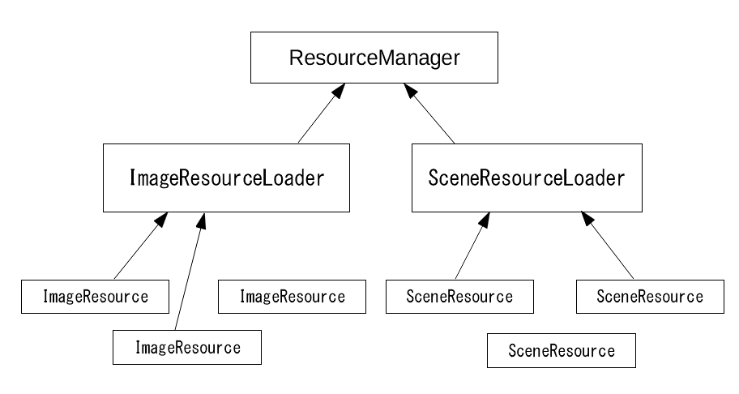

# リソース管理 - Resource management

## 概要

リソース（画像、バッファ、シーンデータ等）の読み込みと解放のしくみ、進捗表示の管理についての説明とサンプルプログラムです。 

ソースコード
- [サンプルプログラム（main.ts）](./main.ts)  
- [リソースマネージャ及び関連クラス（game_resource_manager.ts）](../tips_core/game_resource_manager.ts)


## リソース管理

WebGLの場合、リソースの管理の多くの部分はブラウザが行ってくれます。たとえばページの移動や再読み込みなどの時、ブラウザはWebGLのテクスチャやバッファなどを適切に解放してくれます。しかし、たとえばページを移動しない画面遷移が多数ある場合など、プログラム側でリソース管理を行ったほうがよい場合もあります。

以下に、リソース管理を考えたほうが良いと思われる場合をいくつか挙げます。

- 何度も読み込みと解放を行う場合
- リソースがリソースを参照したり共有することが多い場合
- 複数のリソースの読み込みの進捗を統合して表示したい場合
- 読み込みの並列化や順番の制御がしたい場合

ここで紹介するプログラムは、このような場合をサポートできるリソース管理をマネージャとして実装したものです。

### キーワード

|単語|説明|
|:-----------------|:-------------------------|
|リソース|プログラムの実行時に読み込まれたり確保されたりして利用されるもの全般|
|リソースの種類|画像、バッファ、テクスチャなど、扱う対象により読み込み処理や解放処理が異なるため、種類が増えるとコーディングが煩雑になりがちです|
|リソース管理|リソースを整理された方法でうまく扱うこと|
|リソースマネージャ|リソース管理を実装したもの|


### 必要リソースの読み込み、不要リソースの解放

- シーン遷移により必要になるリソースにフラグを設定
- まず不要になるリソースを解放
- 必要になるリソースのみロード
- ロード済みのリソースはロードしない
- 上記のために必要なリソースの組み合わせの設定をゲーム開始時に構築する


### 並列読み込みと順次読み込み

- ブラウザ、ファイルの種類によって同時に読み込み可能なリクエスト数が違う
- １件ずつ読み込むのが確実
- 画像ファイルは一度にやっても大丈夫らしい
- setTimeout等のループの中で１件ずつ読み込む


### 進捗表示

- 読み込みの進捗を表示
- 読み込みにかかる時間は環境により異なり予測が難しい
- 正確な時間の予測より、ロードが順調に進んでいるのが分かればよい
- リソースの定義に、ロード所要時間の参考値を指定
- 全体の参考値に対する割合で表示する
- なお、嘘でも補間アニメーションしたほうが心地よい感じになる


## サンプルプログラム

### プログラム構成



サンプルプログラムは、１つのマネージャクラス、２つのローダクラス、そしてリソースクラスで構成されます。マネージャクラスはローダを統括する役割を持ちます。ローダクラスはリソースの種類ごとに実装され、リソースの読み込み処理を行う役割を持ちます。各種リソースクラスはファイル名やリソース本体を保持します。

- ローダクラスはリソースの種類ごとにベースクラス ResourceLoaderBase を継承して作成する必要があります。

- リソースクラスはリソースの種類ごとにベースクラス ResourceItem を継承して作成する必要があります。

- マネージャクラスはリソースの種類が増えても実装しなおす必要はありません。


#### 読み込み処理の流れ

- 設定の構築処理の実行
    1. リソースクラスを作成
    2. ローダクラスを作成、ローダにリソースクラスを登録
    3. ロード制御情報を作成
    4. リソースマネージャにローダとロード制御情報を登録

- 読み込み処理の実行
    1. リソースマネージャでロードを開始、ロード待ちループの開始
    2. ローダ毎のリソース毎に順次読み込み処理が実行される
    3. 進捗表示
    4. 全てのロードが終了したらループを終了


#### リソースクラス

ImageResource、SceneResource

このクラスはリソースのファイル名などの設定、リソース本体データへの参照を保持するためクラスです。ResourceItemを継承しています。

なお、サンプルプログラムにはModelResourceクラスも存在しますが、これはシーンリソースの中に含まれているデータを分解したもので、リソース管理の対象ではありません。

#### ローダクラス

ImageResourceLoader、SceneResourceLoader

このクラスはリソースの種類に依存する読み込み処理と解放処理を実装するためのクラスです。ResourceLoaderを継承し、リソースの種類に応じた読み込み処理を行うために次の関数をオーバーライドしています。

- startLoadingResourceItem
- unloadResource

また、並列読み込みの最大数の設定として、maxParallelLoadingCountに初期値を与えています。


#### リソースの設定の記述

サンプルプログラムではプログラム中に記述しています。ゲーム内で使用されるリソースが動的に増減しないのであれば、これでほとんどの場合に対応できるでしょう。リソースの数が多い場合は、リソースの設定を行うコードををジェネレートしたほうがよい場合もあります。

```
	// Image resource settings
	var imageResources = new List<ImageResource>(ImageResourceID.MaxID + 1);

	imageResources[ImageResourceID.None] = new ImageResource();
	imageResources[ImageResourceID.Image00] = new ImageResource().path('image00.png').mipmap(true).weight(1.0);
	imageResources[ImageResourceID.Image01] = new ImageResource().path('image01.png').mipmap(true).weight(1.0);
	imageResources[ImageResourceID.Image02] = new ImageResource().path('image02.png').mipmap(true).weight(1.2);
	imageResources[ImageResourceID.Image03] = new ImageResource().path('image03.png').mipmap(true).weight(1.2);

	this.imageResources = imageResources;

	// Scene resource settings
	var sceneResources = new List<SceneResource>(SceneResourceID.MaxID + 1);

	sceneResources[SceneResourceID.None] = new SceneResource();
	sceneResources[SceneResourceID.Common] = new SceneResource().path('scene00.json').image(ImageResourceID.Image00).weight(1.0);
	sceneResources[SceneResourceID.Scene01] = new SceneResource().path('scene01.json').image(ImageResourceID.Image01).weight(1.0);
	sceneResources[SceneResourceID.Scene02] = new SceneResource().path('scene02.json').image(ImageResourceID.Image02).weight(1.0);

	this.sceneResources = sceneResources;
```


#### ロード制御情報の定義

リソースの設定と同様にプログラム中に記述しています。必要となるリソースの組み合わせを設定します。この設定をリソースマネージャに与えることで、必要となるリソースだけをロードし、不要となるリソースを解放することができます

```
    var loadingSettings = new List<Game.ResourceItemLoadingSettingSet>(SceneID.MaxID + 1);

    loadingSettings[SceneID.None] = new Game.ResourceItemLoadingSettingSet();

    loadingSettings[SceneID.Common] = new Game.ResourceItemLoadingSettingSet()
        .add(sceneResources[SceneResourceID.Common])
        .add(imageResources[ImageResourceID.Image00]);
```


#### マネージャクラス

ResourceManager

このクラスは複数のローダを統括するためのクラスです。このクラスはResourceLoaderを継承したクラスであればどんなクラスでも受け取ることができます。

機能としては以下の機能を持ちます。

- ローダの登録
- リソースの使用フラグを一括設定、解除する
- ロード制御情報に基づく順次読み込みの実行
- 進捗割合計算


## 関連情報
- [TypeScriptによる基本的なWebGLプログラミング](./basic_webgl_ts/)
- [モデルの描画](../basic_model_drawing/)
