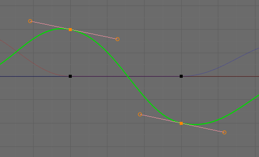

# スキンモデルのアニメーションデータの作成 - Skin model animation data converting

## 概要
Blenderのアニメーションデータのコンバート処理です。.blendファイルを解析してFCurveの内容を取得し、オブジェクトとボーンのアニメーションデータをファイルに出力します。.blendファイルの解析にはBlendFileReader.tsを使用します。

出力はFCurveの内容をほぼそのまま出力したものになります。

ソースコード

- [サンプルプログラム（main.ts）](./main.ts)  
- [BlendFileReader.ts（blend_file_reader.ts）](../tips_core/blend_file_reader.ts)  

## コンバート処理

### 目的のアニメーションデータ

このサンプルプログラムではBlenderのオブジェクトとボーンのアニメーションを対象とします。

Blenderではオブジェクトやボーンを含めほぼ全てのもののアニメーションが下の図のようなFカーブと呼ばれる曲線で制御されています。Fカーブはオブジェクトの位置座標の成分(X, Y, Z)やボーンの回転クォータニオンの成分(X, Y, Z, W)といった数値の時間的な変化を曲線で表したものです。


Fカーブは数学的には３次ベジエ曲線を連続して繋げたものであり、曲線が必ず通る頂点と、曲線の曲がり方を決める制御点をで構成されています。また、データとしては頂点とその前後の制御点２つをまとめたBezTripleという構造体(BlenderはC言語で作られています)のリストで表現されています。コンバート処理ではこのBezTripleを.blendファイルから抽出し、JSONファイルに出力します。



### 入力ファイルの準備

Blenderでアニメーションを作成します。このサンプルプログラムではオブジェクトのアニメーションとボーンのアニメーションを対象ですので、オブジェクト編集モードとポーズ編集モードでそれぞれアニメーションを作成します。


### 入力データ

.blendファイルのロードはXMLHttpRequestで行い、ファイルのパースはBlendFileReader.tsを使用します。BlendFileReaderの使用方法は[.blendファイルからのデータ抽出](./blend_file_reader_sample/)を参照してください。

.blendファイルには様々なデータが含まれますが、Fカーブに関連するデータは以下の通りです。


```
bAction
  id.name
  curves        FCurveのリスト（連結リストの先頭と最後のアドレス）
```

```
bActionGroup
  name          FCurveのグループ名(Location、Rotation、Scaling、またはボーン名)
```


```
FCurve
  grp           bActionGroupのアドレス
  array_index   FCurveの所属するグループ内での成分を識別するインデクス
                Locationグループであれば 0:X, 1:Y, 2:Z など
  bezt          BezTripleのアドレス
```
```
BezTriple（配列）
  vec[3][3] 頂点、制御点の座標
```

アドレスは.blendファイル保存時に各データがメモリ上に存在していたアドレスのことです。アドレスがそのまま保存されているため、ファイル中でも一意なIDになります。そのため、まず全てのbActionを抽出し、bActionごとにFCurve、bActionGroup、BezTripleとIDをたどることで目的のデータを抽出できます。

### 出力ファイル

出力するJSONファイルの構造を以下に示します。アニメーション名にはbActionのnameが入ります。位置、回転、拡縮といったオブジェクトのアニメーションは一つにまとめ、ボーン名のかわりに"Object"という名前で出力します。ボーンのアニメーションはボーンごとにまとめます。成分名はlocationX、locationY、rotationX、rotationYなどを出力します。

```
{
  "アニメーション名": {
    "Objectまたはボーン名": {
      "成分名": {
        "ipoType": 2      補間方法 0：補間なし：、1：線形補間、2：ベジエ補間
        "lastTime": 0     実行時のみ使用するため常に0
        "lastIndex": 0    実行時のみ使用するため常に0
        "curve": [[[1.0,1,0],[2.0,1,0],[3.0,1,0]], ... Fカーブの頂点のリスト
      }
    }
  }
}
```


## サンプルプログラム

### プログラム構成


上の図はクラスと関数の呼び出し関係を表しています。コンバート処理はMainクラスのexecute関数で行われます。この関数は画面のロード時に実行されます。

### コンバート処理の３段階

[モデルデータの作成](./basic_model_converting/)と同様に以下の３段階でコンバート処理を行います。

1. ファイルのパース  
2. 必要データの抽出と再構成  
3. 出力 

### コンバート処理の流れ


上の図はデータとそれを処理する関数の関係を表しています。左側はデータのクラスやファイル、右側は処理を行うクラスと関数です。

parse関数はexecute関数から渡された.blendファイルのデータからアニメーションのデータだけを抽出します。

convert関数はparse関数の結果をよりファイル出力に適した形に変換します。データ構造は変換前と変換後であまり違いはありませんが、アニメーションのデータを分別してオブジェクトに関するものは一つにまとめ、ボーンに関するものはボーンごとにまとめなおしています。


## 関連情報

- [.blendファイルからのデータ抽出](../blend_file_reader_sample/)
- [スキンモデルの描画](./skinning_model_drawing/)
- [スキンモデルのアニメーションの再生](../skin_model_animation_playing/)
