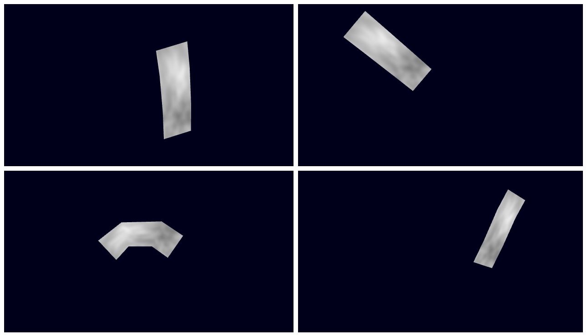
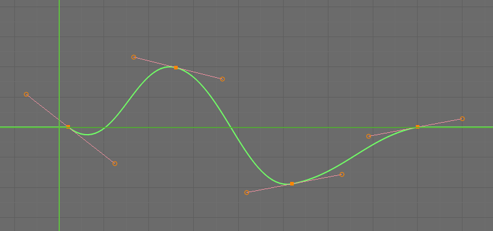
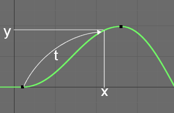
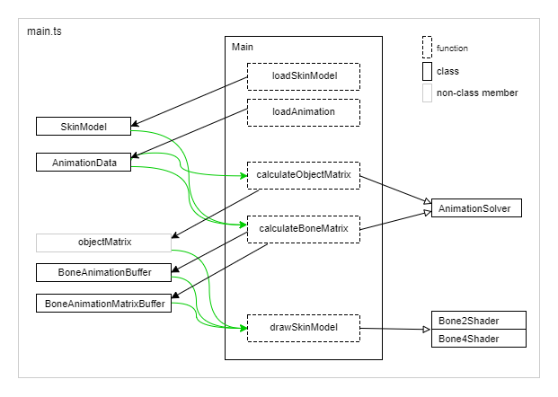

# スキンモデルのアニメーションの再生 - Skin model animation playing

## 概要

スキンモデルのアニメーション再生処理のサンプルプログラムです。オブジェクトのアニメーション処理も行います。

使用するモデルデータは[スキンモデルデータの作成](./skinning_model_converting/)および[スキンモデルのアニメーションデータの作成](./skin_model_animation_converting/)で作成したものです。

なお、ここではアニメーション処理を中心に解説します。描画処理については[スキンモデルの描画](./skinning_model_drawing/)を参照してください。

ソースコード

- [サンプルプログラム（main.ts）](./main.ts)  
- [アニメーション処理（animation.ts）](../tips_core/animation.ts)  

デモの実行

- [Live Demo](https://warotarock.github.io/ptw_tips/tips/skin_model_animation_playing/)

 

## アニメーショの再生

### BlenderとFカーブ

[スキンモデルのアニメーションデータの作成](./skin_model_animation_converting/)で作成したアニメーションデータはBlenderのFカーブをオブジェクトごとやボーンごとに出力したものです。Fカーブは数学的には３次ベジエ曲線を連続して繋げたもので、どのフレーム（X座標）でもたった一つの値（Y座標）を取ります。少ないデータで滑らかに変化する値が得られるため、アニメーションの制御に利用されています。

 

### Fカーブの値の計算

サンプルプログラムでは、Blenderで行われるのと同じようにFカーブから値を計算し、オブジェクトの位置やボーンの角度として使用します。

ベジエ曲線を扱う多くのプログラムは時刻tに対する座標(x,y)を計算しますが、ここではX座標に対するY座標を計算することになります。そのためには、まずベジエ曲線の３次方程式を解いてX座標に対応する時刻tを計算し、そして時刻tに対する座標(x,y)を計算します。この計算処理を実装したものが[animation.ts](../tips_core/animation.ts) のAnimationSolverです。

 

### スキンモデルの描画

スキンモデルの描画については[スキンモデルの描画](./skinning_model_drawing/)を参照してください。

 

## サンプルプログラム

### プログラム構成

上の図はクラスと関数の呼び出し関係を表しています。基本的には[スキンモデルの描画](./skinning_model_drawing/)と同じですが、アニメーションデータのロードが追加され、calcObjectMatrixとcalcBoneMatrixがアニメーションを利用するようになっています。

 

### 処理の流れ

おおまかな流れはスタティックモデルの場合と同じですが、オブジェクトとボーンのアニメーション処理が追加されています。

1. 初期化処理とロードの開始 (initialize関数)
2. 読み込み処理ループ (processLoading関数)
4. 読み込み後処理 (processLoading関数)
5. メイン処理ループ (run関数)
    1. アニメーション時刻の計算
    2. カメラの位置の計算
    3. *オブジェクトのアニメーションと行列の計算*
    4. *ボーンのアニメーションと行列の計算*
6. 描画処理ループ (draw関数)

 

## クラスの解説

※アニメーション以外の部分については[スキンモデルの描画](./skinning_model_drawing/)を参照してください。

 

### AnimationSolver (animation.ts)

- Fカーブの値を計算する
- Fカーブを利用してボーンのアニメーションの計算を行う
- ボーン行列の計算を行う

AnimationSolverはアニメーションに関する計算を行うクラスです。

AnimationSolverはFカーブの値を計算する関数を持ちます。これは単一の値を返す関数です。オブジェクトのアニメーションはこの関数を組みあわせて実現します。

AnimationSolverはFカーブをもとにボーンの位置、回転、拡大縮小の値することでボーンのアニメーションの計算を行います。計算の結果はアニメーションバッファ(BoneAnimationBuffer)に保存されます。２つのアニメーションバッファの内容を合成することもできます。

また、AnimationSolverはアニメーションバッファをもとにボーンの行列を計算します。計算の結果はマトリックスバッファ(BoneAnimationMatrixBuffer)に保存されます。ボーン行列はボーンの親子関係を加味したモデル座標系の値が計算されます。

 

### BoneAnimationBuffer (animation.ts)

- ボーンアニメーションの計算結果を保持
- ボーンごとに位置、回転、拡大縮小の値を持つ
- ２つのBoneAnimationBufferの合成が可能

BoneAnimationBufferはボーンのアニメーションの計算結果を保存するためのクラスです。保存するのはボーンの位置、回転、拡大縮小の値です。これらの値をもとにアニメーションの合成やボーン行列の計算を行います。

２つのBoneAnimationBufferがあれば、それらの中間の値を線形補間で計算し、再びBoneAnimationBufferに計算結果を保存することができます。これにより、例えばあるアニメーションから別のアニメーションへのシームレスな遷移を行ったり、上半身と下半身で別のアニメーションを組み合わせたりすることができます。

 

### BoneAnimationMatrixBuffer (animation.ts)

- ボーンアニメーションの結果から計算したボーン行列を保持
- インデクスとボーン名でボーン行列にアクセスが可能

BoneAnimationMatrixBufferはBoneAnimationBufferをもとに計算したボーン行列を保存するためのクラスです。インデクスと名前のどちらでもボーン行列にアクセスできるようになっています。

 

## 関連情報

- [モデルの描画](../basic_model_drawing/)
- [オブジェクトアニメーションデータの作成](../object_animation_converter/) 
- [スキンモデルの描画](./skinning_model_drawing/)

 
