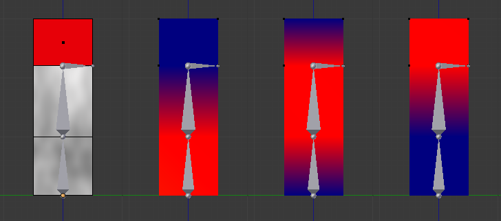
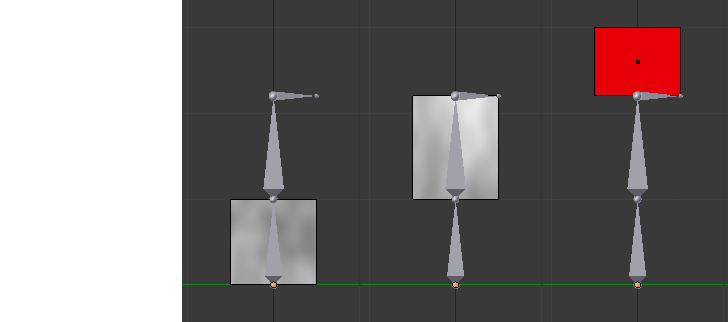
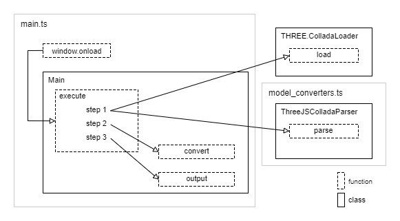
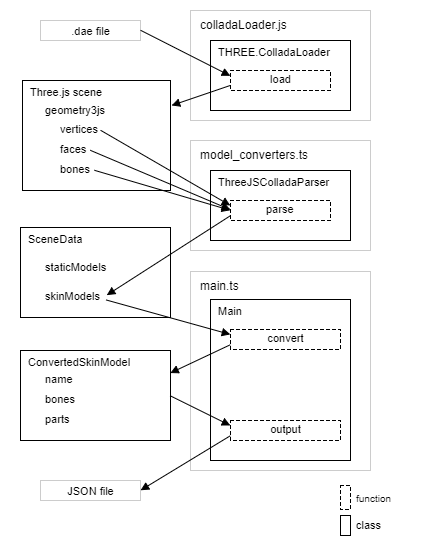

# スキンモデルデータの作成 - Skin model data converting

## 概要

スキンモデルデータのコンバート処理のサンプルプログラムです。

Collada形式(.dae)のファイルからモデル情報を抽出し、json形式(.json)で出力します。
.daeファイルのパースにはThree.jsのColladaLoaderを利用しています。

実行すると画面開始時にコンバートが実行されます。再度コンバートを実行したい場合、デベロッパーツール上でF5を押してください。

ソースコード

- [サンプルプログラム（main.ts）](./main.ts)  
- [パース処理（model_converters.ts）](../tips_core/model_converters.ts)
<br />
<br />

### キーワード

意味の分かりにくい単語がありますので、以下にキーワードをまとめました。

|単語|説明|
|:-----------------|:-------------------------|
|スキンメッシュ|ボーンに合わせて変形するモデルの形状データ。ボーンの情報は含みません。|
|スキンメッシュモデル<br />スキンモデル|スキンメッシュを使用したモデル。ボーンの情報も含みます。|
|パーツ分割済みスキンメッシュモデル<br />パーツ分割スキンモデル|形状データとしてパーツ分割済みスキンを採用したスキンメッシュモデル。|

<br />
<br />

## コンバート処理

### 目的のモデル

目的のモデルデータはバーツ分割済みスキンメッシュモデルとします。これは頂点ごとに４つまでのボーンとの関連を持つことができ、ボーンの動きに合わせて変形して描画することができるモデルです。すべてのポリゴンが三角形であり、頂点は関連するボーンの影響度、座標、法線、テクスチャ座標を持ちます。また、ボーンとマテリアルの組み合わせでパーツ分割されており、パーツごとに描画することで高速にスキンメッシュを描画できます。

下の図は３つのボーンを持つスキンモデルの例です。一番左はモデルに赤色と灰色のマテリアルが設定されていることを示しています。また、左から２番目以降は、ボーン１の影響度、ボーン２の影響度、ボーン３の影響度を表しています。



このモデルをパーツ分けすると下の図のようになります。左から、灰色のマテリアルでボーン１と２の影響を受けるパーツ、灰色のマテリアルで全てのボーンの影響を受けるパーツ、赤色のマテリアルでボーン２と３の影響を受けるパーツとなっています。



なお、テクスチャをはじめとするマテリアルに関する情報はプログラム側で指定することとし、モデルデータには含めません。


### 入力ファイルの準備

[モデルデータの作成](./basic_model_converting/)と同様にBlenderから標準のエクスポータでdaeファイルを作成します。エクスポートの設定は同じですが、以下の点に注意してください。

- このサンプルではスキンモデルだけを出力します。ウェイトが設定されているメッシュとアーマチュアが必要です。

- メッシュに頂点グループが存在するボーンだけが出力されます（エクスポータの仕様）。ウェイトを割り振らないボーンに対しても頂点グループが必要です。

- ファイルのエクスポート時は、Armatureのポーズの状態により、正しくボーンの状態が再現できない場合があるようです。アニメーションの最初のフレームなどにデフォルトのポーズを保存しておくなどして、Armatureが動いていない状態でエクスポートを実行すると改善されるかもしれません。


### 入力データ

.daeファイルのロードとパースにはThree.jsのColladaLoaderを利用します。ColladaLoaderのload関数を実行すると、ロードとパースの終了時にコールバック関数にオブジェクトが渡されます。このオブジェクトがコンバート処理の実質的な入力データとなります。

以下にColladaLoaderの返すオブジェクトのおおまかな構造を示します。ここで\{ \}はオブジェクト、[]は配列を表しています。このオブジェクトがサンプルプログラムの入力データとなります。

```
(ColladaLoaderの返すオブジェクト)
  dae{}
    geometries{}
      mesh{}
        geometry3js{}
          vertices[]      頂点の座標
          faces[]         面の頂点インデクス
          faceVertexUvs[] 面の頂点UV
          bones[]         ボーン情報
          skinIndices[]   頂点ごとの関連するボーン(ボーンの最大数は４つまででx, y, z, wにボーンのインデクスが保存されています)
          skinWeights[]   頂点ごとの関連するボーンのウェイト値(同上)
```


### 出力するモデルデータ

モデルは２つまたは４つのボーンとマテリアルの組み合わせごとにパーツ分けします。頂点データには、関連するボーンごとにボーンのローカル座標での位置とウェイト値を出力します。関連するボーンが１つまたは３つの頂点は、ウェイト値が0のボーンがもう一つある状態として扱います。モデルにはボーンの情報も出力します。

パーツのフォーマットは次の通りです。

|  |内容                        |フォーマット|
|-:|:---------------------------|:-----------|
| 1|マテリアルのインデクス|int|
| 2|ボーンのインデクス|int|
| 3|１頂点のサイズ（floatの個数）|int|
| 4|頂点データの配列|頂点データ * 頂点数|
| 5|面頂点インデクスの配列|int * 3 * 面数|

ボーンが１つまたは２つの頂点データのフォーマットは次の通りです。

|  |内容                        |フォーマット|
|-:|:---------------------------|:-----------|
| 1|ボーン１のウェイト値<br />ボーン１上の頂点位置 x, y, z<br />ボーン１上の頂点法線 x, y, z|float<br />float * 3<br />float * 3|
| 2|ボーン２のウェイト値<br />ボーン２上の頂点位置 x, y, z<br />ボーン２上の頂点法線 x, y, z|float<br />float * 3<br />float * 3|
| 3|テクスチャ座標 u, v         |float * 2 * UVマップの数|

ボーン４つの頂点データのフォーマットは次の通りです。

|  |内容                        |フォーマット|
|-:|:---------------------------|:-----------|
| 1|ボーン１のウェイト値<br />ボーン１上の頂点位置 x, y, z<br />ボーン１上の頂点法線 x, y, z|float<br />float * 3<br />float * 3|
| 2|ボーン２のウェイト値<br />ボーン２上の頂点位置 x, y, z<br />ボーン２上の頂点法線 x, y, z|float<br />float * 3<br />float * 3|
| 3|ボーン３のウェイト値<br />ボーン３上の頂点位置 x, y, z<br />ボーン３上の頂点法線 x, y, z|float<br />float * 3<br />float * 3|
| 4|ボーン４のウェイト値<br />ボーン４上の頂点位置 x, y, z<br />ボーン４上の頂点法線 x, y, z|float<br />float * 3<br />float * 3|
| 5|テクスチャ座標 u, v         |float * 2 * UVマップの数|


ボーンのフォーマットは次のようになります。ルートのボーンは親ボーンのインデクスに-1を出力します。

|  |内容                |フォーマット|
|:-|:-------------------|:-----------|
|1|ボーン名             |string      |
|2|親ボーンのインデクス |int         |
|3|ボーン行列           |float * 16  |


### 出力ファイル

出力するJSONファイルの構造を以下に示します。

```
{
  "skin_models": {
    "モデル名": {
      "bones": [
        {
          "name": "ボーン名",
          "parent": 親ボーンのインデクス,
          "matrix": [ボーン行列]
        }
      ],
      "parts": [
        {
          "bone": [ボーンのインデクス(２つまたは４つ)],
          "material": マテリアルのインデクス,
          "vertexStride": １頂点のサイズ,
          "vertex": [頂点データ(インターリーブ配列)],
          "index": [面の頂点インデクス]
        }
      ]
    }
  }
}
```


## サンプルプログラム

### プログラム構成



上の図はクラスと関数の呼び出し関係を表しています。コンバート処理はMainクラスのexecute関数で行われます。この関数は画面のロード時に実行されます。

コンバート処理では、まずThree.jsのColladaLoaderのload関数でファイルを読み込み、その後コンバート処理の各ステップを実行します。

### コンバート処理の３段階

[モデルデータの作成](./basic_model_converting/)と同様に以下の３段階でコンバート処理を行います。

1. ファイルのパース  
2. 必要データの抽出と再構成  
3. 出力 

### コンバート処理の流れ



上の図はデータとそれを処理する関数の関係を表しています。左側はデータのクラスやファイル、右側は処理を行うクラスと関数です。おおまかな流れは[モデルデータの作成](./basic_model_converting/)と同様です。


## クラスの解説

### ConvertedSiknModel (main.ts)

Main.convert関数が返すオブジェクトのクラスです。スキンモデルを描画するために必要なデータであるbonesとpartsを持ちます。

bonesはボーン情報のリストです。リスト内の順番は、行列計算などの階層構造を考慮する必要のある処理を行いやすいように、ルートに近いボーンの階層から順に並んだ状態になっています。

partsはパーツ分割済みスキンメッシュモデルのデータのリストです。リスト内の順番は厳密な意味はありませんが、マテリアルのインデクス順のうえでボーンのインデクス順になっています。半透明の場合など先に描画したいマテリアルがある場合に役に立つかもしれません。


## 使用外部ライブラリ

- THREE.js, colladaLoader.js
- Linq.js (Enumerable)


## 関連情報

- [スキンモデルの描画](./skinning_model_drawing/)
