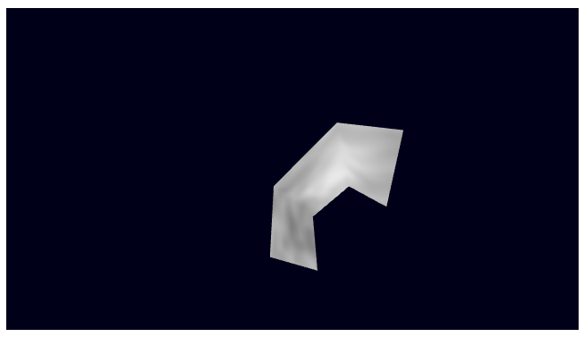

# スキンモデルとアニメーションの再生 - Skinning model drawing

## 概要

※作成途中です

スキンモデルの描画処理です。
ここで使用するモデルデータは[スキンモデルデータの作成](./skinning_model_converting/)で作成したものです。

ソースコード

- [サンプルプログラム（main.ts）](./main.ts)  
- [アニメーション（animation.ts）](../tips_core/animation.ts)  

デモの実行

- [Live Demo](https://warotarock.github.io/ptw_tips/tips/skinning_model_drawing/)

## スキンモデルの描画処理

### パーツ分け済みモデルデータ

[スキンモデルデータの作成](./skinning_model_converting/)で作成したモデルデータは、２つまたは４つのボーンとマテリアルの組み合わせごとにパーツ分けされています。そのため、ひとつのモデルを描画するには全てのパーツごとに描画を繰り返します。

なおボーンが１つや３つの場合は、空の情報を一つ追加して２つまたは４つになるようにしています。

### 頂点データ

ひとつのパーツには頂点データとインデックスデータがボーンの個数分含まれます。
また、UV座標が一つ含まれます。ボーンが１つまたは２つの頂点データのフォーマットは次のようになります。

|  |内容                        |フォーマット|
|-:|:---------------------------|:-----------|
| 1|ボーン１のウェイト値        |float       |
| 2|ボーン１上の頂点位置 x, y, z|float * 3   |
| 3|ボーン１上の頂点法線 x, y, z|float * 3   |
| 4|ボーン２のウェイト値        |float       |
| 5|ボーン２上の頂点位置 x, y, z|float * 3   |
| 6|ボーン２上の頂点法線 x, y, z|float * 3   |
| 7|UV座標 u, v                 |float * 2 * UVマップの数|

ボーン４つの頂点データのフォーマットは次のようになっています。

|  |内容                        |フォーマット|
|-:|:---------------------------|:-----------|
| 1|ボーン１のウェイト値        |float       |
| 2|ボーン１上の頂点位置 x, y, z|float * 3   |
| 3|ボーン１上の頂点法線 x, y, z|float * 3   |
| 4|ボーン２のウェイト値        |float       |
| 5|ボーン２上の頂点位置 x, y, z|float * 3   |
| 6|ボーン２上の頂点法線 x, y, z|float * 3   |
| 7|ボーン３のウェイト値        |float       |
| 8|ボーン３上の頂点位置 x, y, z|float * 3   |
| 9|ボーン３上の頂点法線 x, y, z|float * 3   |
|10|ボーン４のウェイト値        |float       |
|11|ボーン４上の頂点位置 x, y, z|float * 3   |
|12|ボーン４上の頂点法線 x, y, z|float * 3   |
|13|UV座標 u, v                 |float * 2 * UVマップの数|

※このサンプルでは法線の情報は使用せずに描画を行います。そのためシェーダクラスでバッファの設定を行う際にスキップされるように設定しています。

※このサンプルではボーンのアニメーションは計算で設定しています。アニメーションデータはありません。

### シェーダクラス

## 関連情報

- [オブジェクトアニメーションの再生](./object_animation_drawing/)
- [スキンモデルデータの作成](./skinning_model_converting/)

