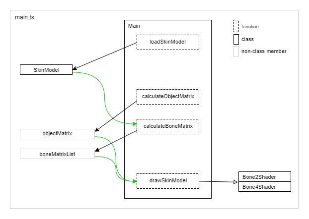

# スキンモデルの描画 - Skin model drawing

## 概要

スキンモデルの描画処理です。ここで使用するモデルデータは[スキンモデルデータの作成](./skinning_model_converting/)で作成したものです。

なお、このサンプルではボーンのアニメーションは計算で生成しています。アニメーションデータはありません。

ソースコード

- [サンプルプログラム（main.ts）](./main.ts)  
- [アニメーション（animation.ts）](../tips_core/animation.ts)  

デモの実行

- [Live Demo](https://warotarock.github.io/ptw_tips/tips/skinning_model_drawing/)

 

## スキンモデルの描画処理

### パーツ分割済みスキンメッシュモデル

使用するモデルデータはパーツ分割済みスキンメッシュモデルです。このモデルは２つまたは４つのボーンとマテリアルの組み合わせごとにパーツ分けされています。そのため、ひとつのモデルを描画するには全てのパーツごとに描画を繰り返します。

下の図は３つのボーンを持つモデルの、パーツごとの描画のイメージです。左から、モデル全体、灰色のマテリアルでボーン１と２の影響を受けるパーツ、灰色のマテリアルで全てのボーンの影響を受けるパーツ、赤色のマテリアルでボーン２と３の影響を受けるパーツです。

それぞれのパーツを描画する際には、パーツが影響を受けるボーンの行列をシェーダに設定します。ボーンが２つの場合は２つのボーン行列、４つの場合は４つのボーン行列を設定します。ボーン行列は多くの場合はアニメーションデータをもとに計算しますが、このサンプルプログラムでは時刻から計算しています。

次の図はボーンが回転した状態のボーン行列で全てのパーツを描画した場合のイメージです。ボーンの回転に合わせてモデルが変形していることが分かります。

なおボーンが１つや３つの場合は、モデルデータを作成する時点でウェイト値が0のボーンを一つ追加して２つまたは４つになるようにしています。

 

### モデルデータ

モデルには複数のパーツと複数のボーン情報が含まれます。パーツにはマテリアルやボーン、頂点情報などパーツごとの描画に必要な情報が含まれています。

パーツのフォーマットは次の通りです。

|  |内容                        |フォーマット|
|-:|:---------------------------|:-----------|
| 1|マテリアルのインデクス|int|
| 2|ボーンのインデクス|int|
| 3|１頂点のサイズ（floatの個数）|int|
| 4|頂点データの配列|頂点データ * 頂点数|
| 5|面頂点インデクスの配列|int * 3 * 面数|

ボーンが１つまたは２つの頂点データのフォーマットは次の通りです。

|  |内容                        |フォーマット|
|-:|:---------------------------|:-----------|
| 1|ボーン１のウェイト値 ボーン１上の頂点位置 x, y, z ボーン１上の頂点法線 x, y, z|float float * 3 float * 3|
| 2|ボーン２のウェイト値 ボーン２上の頂点位置 x, y, z ボーン２上の頂点法線 x, y, z|float float * 3 float * 3|
| 3|テクスチャ座標 u, v         |float * 2 * UVマップの数|

ボーン４つの頂点データのフォーマットは次の通りです。

|  |内容                        |フォーマット|
|-:|:---------------------------|:-----------|
| 1|ボーン１のウェイト値 ボーン１上の頂点位置 x, y, z ボーン１上の頂点法線 x, y, z|float float * 3 float * 3|
| 2|ボーン２のウェイト値 ボーン２上の頂点位置 x, y, z ボーン２上の頂点法線 x, y, z|float float * 3 float * 3|
| 3|ボーン３のウェイト値 ボーン３上の頂点位置 x, y, z ボーン３上の頂点法線 x, y, z|float float * 3 float * 3|
| 4|ボーン４のウェイト値 ボーン４上の頂点位置 x, y, z ボーン４上の頂点法線 x, y, z|float float * 3 float * 3|
| 5|テクスチャ座標 u, v         |float * 2 * UVマップの数|

ボーンのフォーマットは次のようになります。ルートのボーンの場合、親ボーンのインデクスは-1となります。

|  |内容                |フォーマット|
|:-|:-------------------|:-----------|
|1|ボーン名             |string      |
|2|親ボーンのインデクス |int         |
|3|ボーン行列           |float * 16  |

※このサンプルでは法線の情報は使用せずに描画を行います。そのためシェーダクラスでバッファの設定を行う際にスキップされるように設定しています。

 

## サンプルプログラム

### プログラム構成

上の図はクラスと関数の呼び出し関係を表しています。なお描画に関する基本的な部分は省略しています。（参考：[TypeScriptによる基本的なWebGLプログラミング](./basic_webgl_ts/)）

まずloadSkinModel関数によリスキンモデルのロードが開始され、ロードが終わるとメイン処理と描画処理が行われるようになります。

メイン処理ではcalculateObjectMatrix関数が呼び出され、オブジェクトのアニメーション処理とオブジェクト行列の計算が行われます。

さらにメイン処理ではcalculateBoneMatrix関数が呼び出され、スキンモデル中のボーンに対してアニメーション処理とボーン行列の計算が行われます。なお、このサンプルプログラムではアニメーションのデータは計算で生成しています。

描画処理ではdrawSkinModel関数が呼び出され、スキンモデルと計算済みのボーン行列を使用してパーツごとの描画が実行されます。パーツの描画ではボーンの数によりシェーダを切り替えて使用します。ボーンが２つであればBone2Shader、４つであればBone4Shaderを使用します。そしてシェーダに対応する個数のボーンの行列を設定して描画を行います。

なおマテリアルについては簡単のためにモデルデータに情報を出力していないため、描画の際にプログラムでマテリアルのインデクスに合わせて色情報をシェーダに設定しています。

 

### 処理の流れ

おおまかな流れはスタティックモデルの場合と同じですが、ボーンのアニメーション処理が追加されています。

1. 初期化処理とロードの開始 (initialize関数)
2. 読み込み処理ループ (processLoading関数)
4. 読み込み後処理 (processLoading関数)
5. メイン処理ループ (run関数)
    1. アニメーション時刻の計算
    2. カメラの位置の計算
    3. オブジェクトの位置と行列の計算
    4. *ボーンのアニメーションと行列の計算**
6. 描画処理ループ (draw関数)

 

## クラスの解説

### SkinModel (main.ts)

- スキンモデルデータを保持
- 読み込み済みフラグを保持

読み込み処理のためスキンモデルデータと読み込み済みフラグを持つクラスです。

 

### Bone2Shader、Bone4Shader (main.ts)

- スキンモデルを描画するシェーダクラス
- ボーン行列、マテリアルをシェーダに設定する関数を持つ
- Bone4ShaderはBone2Shaderを継承
- 法線の情報は使用しないためスキップされる

Bone2Shaderは２つのボーン、Bone4Shaderは４つのボーンから影響を受けるパーツを描画するシェーダクラスです。ボーン行列やマテリアルの情報をWebGLに設定する関数を持ちます。

Bone4ShaderはBone2Shaderを継承しています。Bone2Shaderには最初の２つのボーンに関する処理を記述し、Bone4Shaderでは（できるだけ）残りの２つのボーンに関する処理だけを記述しています。

モデルデータには法線の情報が含まれていますが、このサンプルプログラムでは使用しません。

なお前述のようにモデルデータにはマテリアルの情報は含まれていないため、プログラムから色情報としてベクトルを受け取るようにしています。

 

## 関連情報

- [スキンモデルデータの作成](./skinning_model_converting/)
- [スキンモデルのアニメーションデータの作成](./skin_model_animation_converting/)
- [スキンモデルのアニメーションの再生](../skin_model_animation_playing/)

 

