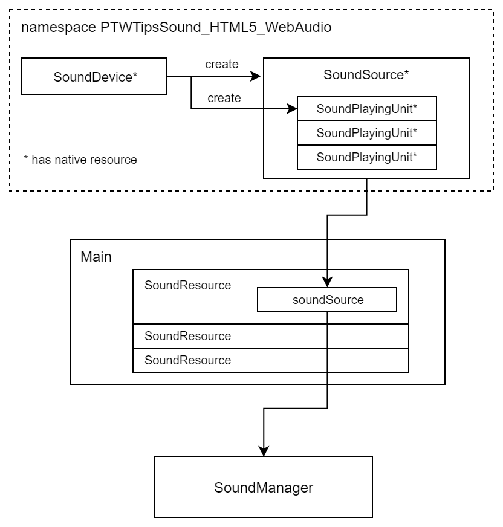

# サウンド管理 - Sound management

## 概要

マルチプラットフォーム対応を考慮した複数デバイス対応の音声再生（ここではHTMLのAudio要素、WebAudioに対応）についての解説とサンプルプログラムです。

ソースコード

- [サンプルプログラム（main.ts）](./main.ts)
- [基本クラス、サウンドマネージャ（sound.ts）](../tips_core/sound.ts)
- [HTML5 Audioでの音声再生クラス（sound_html5_audio.ts）](../tips_core/sound_html5_audio.ts)
- [HTML5 WebAudioでの音声再生クラス（sound_html5_webaudio.ts）](../tips_core/sound_html5_webaudio.ts)

## サウンド管理

### 一般的な音声再生システムの構成

筆者は、音声再生のためのシステムの多くは以下の３つの要素で構成されていると考えています。より高度なものにはノードを使ったシステムなどがありますが、この３要素の構成でもゲームに必要な最低限の機能を実現することが可能です。サンプルプログラムはこの構成を意識して実装しています。

|要素|説明|
|:-----------------|:-------------------------|
|デバイス|音声再生システムの中核となるもので、音源や再生ユニットを生成する機能とマスタ音量の機能を持ちます。Audio要素のように、存在しないか直接利用できない環境もあります。|
|音源|多くの場合はファイル単位にメモリ上にロードされた波形データがこれに相当します。動的に音声を生成する場合もあります。|
|再生ユニット|音声の再生や停止などの操作を行う対象で、１つの音源をもとに複数生成されます。|

### Web環境での音声再生

ブラウザ上で音声を再生する方法はWeb標準技術として２つ存在します。一つはHTMLのAudio要素を利用する方法、もう一つはWebAudioを利用する方法です。Audio要素は比較的簡単に音声を再生でき、WebAudioはより高度な音声再生処理ができるため、目的に応じて使い分けることができます。

ただし、モバイルのWeb環境での音声再生にはブラウザごとに異なる様々な制限が存在します。特に現在（2017年10月時点）ではAudio要素はSafariブラウザでの制限が厳しいため、ゲームでの利用を前提とした場合はWebAudioを使用することになるでしょう。

### Android環境での音声再生

ゲーム「トリノワールド」ではテストの多くをブラウザ上で行いましたが、リリースはAndroidのネイティブアプリでした。そのためWebAudioの代替手段としてSoundPoolを使用しました。その際は、WebAudioと同じ挙動をする中間層を用意することでゲームシステム側の修正をできるだけ少なくしました。そのためには、音声再生に関する処理がゲームシステム側から見て隠蔽されている必要があります。

### マルチプラットフォーム対応の設計

もし、既存のゲームエンジンなどを使わずに様々な環境に対応したゲームシステムを実現したい場合は、ゲームシステムから見て音声再生処理の中核部分は隠蔽されるように最初から設計するとよいでしょう。

サンプルプログラムでは、音声再生処理をデバイスクラスとして抽象化、隠蔽することで、マネージャに与えるデバイスクラスを取り替えるだけでマルチプラットフォーム対応がしやすいようにしています。

### 音声再生のコントロール

ゲームでは音声の再生と停止以外にも様々な操作を行うことがあります。以下はその代表的なものです。サウンド管理では、音声を再生する単位ごとにこれらの操作を実現することになります。

- 音量の調節
- フェードイン・フェードアウト
- パン（左右の音量を別々に変化させる）
- ループ再生

## サンプルプログラム

### プログラム構成

下の図はWebAudioの場合のクラス間の関係を示しています。実践の四角はクラスの実体、矢印はデータ的な流れの方向を表したものです。なお、＊印のあるものはネイティブのリソースを保持するクラスです。たとえば、WebAudioであればAudioContextやAudioBuffer、AudioBufferSourceNodeなどを保持するクラスです。

### 処理の流れ

1. SoundDeviveの生成
2. SoundDevive.initializeによるデバイスの初期化
3. リソースの設定（SoundResource）のリストを作成
4. SoundResourceごとにSoundDevice.createSoundSourceでSoundSourceを生成し、  
音声データのロードを開始  
※SoundPlayingUnitはSoundSourceの生成時に内部で生成されます
5. ロード待ちループ
6. ロードの完了
7. ボタンイベント時、SoundSource.playにより音声再生を実行

### デバイス(SoundDevice)

PTWTipsSound.SoundDeviceを継承したクラスです。PTWTipsSound.SoundDeviceは実際に音声再生を行う機能は何も実装されておらず、ほぼインターフェースに近いものです。実装済みの機能には次のものがあります。

- マスタ音量値の保持

実際に音声再生を行うためにはデバイスクラスに以下の機能を実装します。

- 音声再生が可能な実行環境であるかどうかをの判定
- 音声再生機能の初期化
- 音源の生成（多くの場合、同時に再生ユニットも生成します）

### 音源(SoundSource)

PTWTipsSound.SoundSourceを継承したクラスです。実装済みの機能には次のものがあります。

- 音声再生の開始  
自身の持つSoundPlayingUnitの中から再生中でないものを検索し、音声再生を実行します

実際に音声再生を行うためには以下の機能を実装します。

- 音声データなどのリソースを保持
- 同時再生可能数の再生ユニットを保持
- １フレーム内での複数再生の開始をしないためのフラグを保持

### 再生ユニット(SoundPlayingUnit)

PTWTipsSound.SoundPlayingUnitを継承したクラスです。実装済みの機能には次のものがあります。

- フェードイン、フェードアウト処理のための機能
- ループ再生のための機能

実際に音声再生を行うためには以下の機能を実装します。

- デバイスに依存する再生単位のオブジェクト、ハンドル、ＩＤなどの保持  
（Audio要素、AudioBufferSourceNodeなど）
- 再生状態の取得と操作
  - 音量
  - ポーズ状態
  - ループ再生の状態
  - フェードイン・フェードアウトの状態

### サウンドマネージャ(SoundManager)

サウンドマネージャはここまで説明してきたクラスを統合して扱うための機能を持ちます。デバイスには依存しない機能だけを持ちます。

- 再生終了した再生ユニットの回収処理
- フェードイン、フェードアウト処理の実行
- ループ再生処理の実行
- １フレーム内での複数再生の開始をしないためのフラグを解除する

## 関連情報

音声素材：ザ・マッチイメイカァズ　様