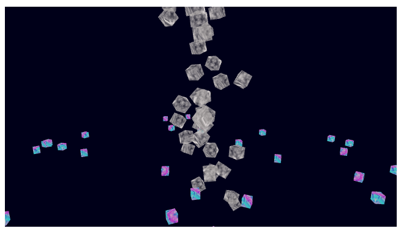

# タスク管理 - Task management

## 概要
ゲーム内の様々な動きを制御するタスクとその管理についての説明です。  

ソースコード
- [サンプルコード（main.ts）](./main.ts)
- [タスクマネージャ（game_task_manager.ts）](../tips_core/game_task_manager.ts)
- [タスク実行環境変数（game_task_environment.ts）](../tips_core/game_task_environment.ts)

デモの実行

- [Live Demo](https://warotarock.github.io/ptw_tips/tips/task_management/)



<br />

## タスク管理
「トリノワールド」に登場するキャラクターやオブジェクトは、自分の役割によって自律的に動いているように見えます。また、時系列のあるイベントなど目に見えない現象についても、自律的に動作するものがあります。
しかもこれらは様々なバリエーションが存在します。

ここで紹介するタスク管理のプログラムは、このような自律的に動いたりバリエーションが複数あるものをオブジェクト指向のプログラミング手法で実現するものです。

なお、各種の単語は概ね以下のような意味で使っています。

|単語|説明|
|:-|:-|
|タスク|自律的に動く単位となるもの、その実装の単位となるクラス|
|タスクシステム|タスクという概念を実現するシステムまたはアルゴリズム|
|タスク管理|タスクを整理された方法でうまく扱うこと|
|タスクマネージャ|タスク管理を実装したもの|

<br />

### タスクとそのクラスの実装
ゲーム「トリノワールド」ではTypeScriptのクラスの機能を利用してタスクを実装しました。

```
タスクベースクラス
　-> コントローラクラス
　　-> シーン制御
　　-> メニュー遷移制御
　　-> ＵＩ制御
　　　-> パネル、ボタン、テキストなど

　-> 描画オブジェクトタスク
　　-> 背景オブジェクト
　　-> 敵機
　　　-> ザコ、ボス -> ステージごとの敵機
　　-> 弾
　　　-> 味方弾、敵弾 -> 通常弾、球弾などの各種弾
　　-> エフェクト
　　　-> 爆発、グローなどの各種エフェクト

　※->は左側が親、右側が子の継承関係にあることを表しています
　※自機本体はタスクを使わずに実装
```

例えば弾であれば、ベースとなる「弾」クラスは基本的な弾としての機能（目標に向かって飛んでいく等）を持ちます。見た目は単純な弾の形でアニメーションはありません。その子クラスである「通常弾」クラス、「球弾」クラスでは、コーティングにより見た目とアニメーションだけを変えています。

サンプルプログラムではこれらよりも継承関係は単純ですが、同様の考え方でクラスを設計してあります。これについては後の項目で説明します。

<br />

### タスク実行環境変数によるアクセス可能範囲の管理
タスクからアクセスできるタスク外の機能やデータはできるだけ限られた範囲に限定すべきであると筆者は考えています。そのためタスクにはタスク実行環境変数（TaskEnvironment）のみを与え、タスクはそれ以外の変数にはアクセスできない形で実行されるようにしています。

サンプルプログラムでは実行環境変数に他のサブシステム（WebGLRenderなど）への参照を単純に持たせていますが、タスクがアクセスできる範囲をさらに制限することも考えられます。次の例のように、他のサブシステムの一部の機能だけを利用可能な環境変数クラスを設計することで実現できます。

例）
```
class TaskEnvironment {

  private render: WebGLRender;　// privateのためタスクからアクセス不可
	
  constructor(render: WebGLRender) {
    this.render = render;
  }

  setCulling(enable: boolean) { // WebGLRenderのsetCullingのみ使用可能
    this.render.setCulling(enable);
  }

  ...
}
```

<br />

## サンプルプログラム

サンプルプログラムでは描画オブジェクト制御するタスクを実装しています。
タスクは次のような継承関係を持ちます。

```
Game.TaskClass
　-> RenderObjectTask
　　-> SampleTask1
　　　-> SampleTask2
```

- Game.TaskClass：全てのタスクのベースクラス
- RenderObjectTask：開始時に描画オブジェクトを作成し、終了時に破棄するタスク
- SampleTask1：最終的な実装クラスの例１。上昇するキューブ。
- SampleTask2：最終的な実装クラスの例２。回転するキューブ。

<br />

## クラスの解説

### TaskClass (game_task_manager.ts)

- タスクのベースクラス
- タスクの状態を保持 (create、active、waitingForDestroy)
- オーバーライド用のイベント関数を持つ
- 再利用可能(IRecyclableObjectであり、リサイクルプールへの参照を保持)

タスクのベースクラスです。ゲームで使用されるタスククラスはこのクラスを継承して作成することになります。

このクラスは次のイベント関数を持ちます。

|イベント関数      |説明|
|:-----------------|:---|
|onCreate          |タスクがタスクマネージャに登録されるときに実行されるイベント関数です。  タスクの状態はこのイベントの直後にactiveになります。|
|run               |メイン処理の１フレームごとに実行されるイベント関数です。|
|onBeforeRendering |描画処理の前に実行されるイベント関数です。|
|onDestroy         |タスクが削除されるときに実行されるイベント関数です。  対象となるのはタスクマネージャのdestroyTask関数でタスクの状態がwaitingForDestroyになったタスクです。  タスクはこのイベントの直後にタスクマネージャから削除されます。|

ゲームで実際に使用されるタスククラスでは、これらの関数をオーバーライドして独自の機能を実装します。これらの関数はそれぞれのタイミングでタスクマネージャから実行されます。run関数はメイン処理の１フレームごとに実行されますので、いわばタスクが自律的に動作していることになるでしょう。

タスクの状態には次の３つの状態があります。

|イベント関数      |説明|
|:-----------------|:---|
|create          |タスクがタスクマネージャに登録されonCreateイベントが終わる前の状態です。|
|active         |onCreateイベントが終わった後の状態です。run関数などのイベントはこの状態のときだけ実行されます。|
|waitingForDestroy |タスクが削除待ちのときの状態です。この状態のとき各イベントは実行されません。  この状態のタスクはメイン処理の最後にonDestroyイベントが実行され、その後タスクマネージャから削除されます。|

削除待ちの状態はタスクが他のタスクを参照している場合に参照しているタスクが削除されることを検出するのに役立ちます。

<br />

### TaskManager (game_task_manager.ts)

- タスクのイベント関数の一括実行
- タスクの削除と再利用処理の実行

タスクを一括で管理するクラスです。登録されたタスクのイベント関数を一括して実行することが主な役割です。

また、タスクの削除も行います。削除の際にはタスクがリサイクルプールへの参照を持っている(nullでない)場合、再利用処理を行います。

<br />

## 関連情報
- [オブジェクト・プーリング（再利用管理）](../object_pooling/)
- [モデルの描画](../basic_model_drawing/)
- [描画オブジェクト管理](../render_object_management/)
